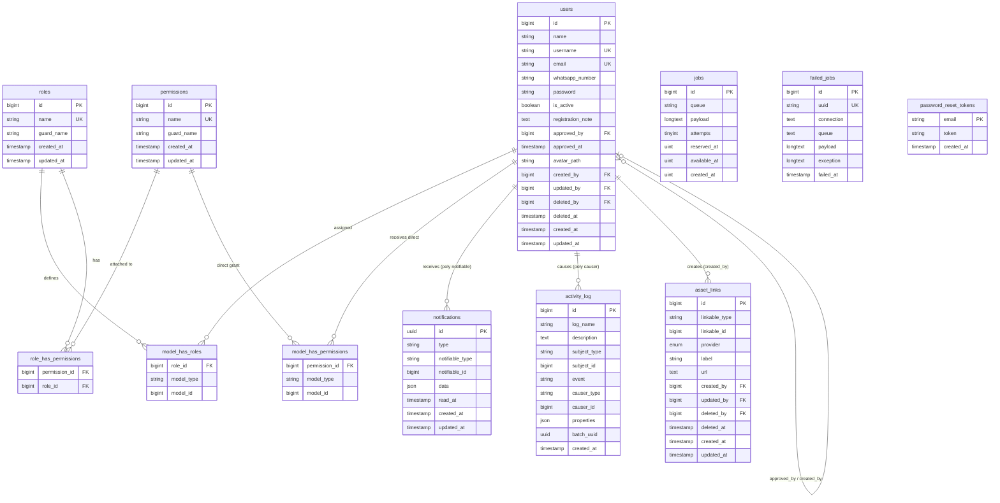

---
tags:
    - project/creative-universe
    - erd
    - database-design
    - main-app
    - laravel-11
    - architecture
status: "APPROVED - Database Baseline"
version: "1.2"
created: 2026-06-15
revised: 2026-06-19
locked: false
owner: Divisi Creative  -  PT Doran Sukses Indonesia (JETE)
supersedes: "v1.1 (2026-06-16)"
references: "CreativeUniverse-MainApp_SRD v7.0 (2026-06-19)"
changelog:
    - "v1.2: Baseline role dan permission diselaraskan dengan RolePermissionSeeder aktual"
    - "v1.2: Status ODDS dikoreksi menjadi belum diimplementasikan"
    - "v1.2: ERD dinyatakan tetap berlaku pada arsitektur Laravel REST API + Next.js"
    - "v1.0: Dokumen ERD Main App dibuat berdasarkan SRD v6.2"
    - "v1.0: 12 entitas diidentifikasi dan diklasifikasikan ke dalam 6 grup fungsional"
    - "v1.0: Self-referencing pada tabel users (4 kolom FK) didefinisikan eksplisit"
    - "v1.0: Tiga polymorphic relations (asset_links, notifications, activity_log) didokumentasikan"
    - "v1.0: Matriks relasi lengkap dengan kardinalitas ditambahkan di Seksi 6"
    - "v1.0: Batas scope Main App vs Sub-App didefinisikan eksplisit di Seksi 10"
    - "v1.0: Checklist integrasi Sub-App dengan Core ERD ditambahkan di Seksi 10.4"
    - "v1.1: Referensi diupdate ke SRD v6.3  -  seluruh link section number disesuaikan"
    - "v1.1: Seksi 2.1  -  prinsip 'RBAC Dynamic-First' ditambahkan: roles/permissions tumbuh di application layer tanpa perubahan skema"
    - "v1.1: Seksi 3  -  keterangan Grup D (Notification System) diperbarui: mencantumkan Pusher Broadcasting sebagai mekanisme delivery real-time"
    - "v1.1: Seksi 5.2 (roles)  -  info note diperbarui: role tidak lagi fixed 3, dapat bertambah dinamis via UI; tabel seed diperbarui menjadi 'Initial Default Seed'"
    - "v1.1: Seksi 5.3 (permissions)  -  warning diperbarui: dua jalur penambahan permission (seeder untuk batch init, UI untuk perubahan operasional)"
    - "v1.1: Seksi 5.6 (role_has_permissions)  -  mapping table di-reframe sebagai initial default state, bukan fixed state"
    - "v1.1: Seksi 5.8 (notifications)  -  status note dan tabel Notification Classes diperbarui: channel 'broadcast' (Pusher) ditambahkan ke semua class; Pusher tidak menambahkan tabel baru ke ERD"
    - "v1.1: Seksi 5.10 (jobs)  -  lifecycle note diperbarui: mencantumkan bahwa Pusher HTTP call dieksekusi dari dalam queue job"
    - "v1.1: Seksi 5.11 (failed_jobs)  -  monitoring warning diperbarui: mencantumkan failed_jobs pada Pusher broadcast sebagai indikator notifikasi real-time gagal"
    - "v1.1: Seksi 7.3 (activity_log)  -  contoh baris data diperbarui: tambah baris audit untuk operasi RBAC (create/update/delete role)"
    - "v1.1: Seksi 10.1  -  kolom 'Cara Pengelolaan' tabel roles/permissions diperbarui: mencantumkan UI management via manage-roles permission"
    - "v1.1: Seksi 10.5 Checklist  -  item baru ditambahkan: Notification Sub-App wajib menggunakan channel 'broadcast'"
---

# CreativeUniverse-MainApp_ERD

> [!info] Sifat Dokumen
> Dokumen ini adalah **Entity Relationship Document (ERD)** yang mendefinisikan seluruh entitas dan relasi database yang menjadi tanggung jawab **Main App (Core)** Creative Universe. Skema entitas domain spesifik Sub-App (Project, Task, Ticket, dan sebagainya) **tidak termasuk** dalam scope dokumen ini dan didefinisikan di SRD masing-masing Sub-App.

> [!warning] Referensi Wajib
> Seluruh skema di dokumen ini **WAJIB** konsisten dengan **CreativeUniverse-MainApp_SRD v7.0**. Pemisahan Laravel REST API dan Next.js tidak mengubah kepemilikan database: seluruh skema tetap dimiliki backend.

---

## Daftar Isi

1. [[#1. Tujuan & Scope Dokumen]]
2. [[#2. Filosofi & Prinsip Perancangan ERD]]
3. [[#3. Klasifikasi Entitas]]
4. [[#4. Entity Relationship Diagram]]
5. [[#5. Skema Detail Entitas]]
6. [[#6. Matriks Relasi & Kardinalitas]]
7. [[#7. Analisis Polymorphic Relations]]
8. [[#8. Aturan Kepemilikan Data (Ownership)]]
9. [[#9. Strategi Indexing Database]]
10. [[#10. Batas Scope  -  Main App vs Sub-App]]

---

## 1. Tujuan & Scope Dokumen

### 1.1 Tujuan

ERD ini dirancang sebagai **acuan teknis tunggal** untuk:

- Implementasi migration Laravel, memastikan urutan dan dependensi antar tabel dibuat dengan benar
- Validasi relasi antar Model di `app/Models/Core/`
- Onboarding developer baru terhadap struktur database Core sebelum menyentuh codebase
- Menjadi referensi resmi saat membuat Sub-App baru, khususnya untuk mengetahui tabel mana yang boleh di-reference dan bagaimana cara melakukannya

### 1.2 Scope Dokumen

| ✅ Termasuk dalam Scope                           | ❌ Di Luar Scope (Delegasi ke SRD Sub-App)               |
| ------------------------------------------------- | -------------------------------------------------------- |
| Tabel `users` dan seluruh atributnya              | Tabel spesifik Sub-App (`tickets`, `projects`, dll.)     |
| Tabel RBAC Spatie (`roles`, `permissions`, pivot) | Relasi internal antar entitas Sub-App                    |
| Tabel `asset_links` (shared polymorphic)          | Skema migration detail Sub-App                           |
| Tabel `notifications` (Laravel built-in)          | Permission slug spesifik Sub-App                         |
| Tabel `activity_log` (Spatie activitylog)         | Ownership data di tabel Sub-App                          |
| Tabel infrastruktur Queue (`jobs`, `failed_jobs`) | Konfigurasi Pusher dan broadcasting (tidak ada DB table) |
| Tabel `password_reset_tokens`                     |                                                          |

> [!info] Pusher Broadcasting Tidak Menambahkan Tabel
> Sistem real-time Pusher bekerja sepenuhnya di luar database  -  server mengirim HTTP request ke Pusher API, dan Pusher mendistribusikan event ke browser via WebSocket. Tidak ada tabel baru di ERD untuk Pusher. Notifikasi tetap tersimpan di tabel `notifications` seperti sebelumnya; Pusher hanya berperan sebagai delivery mechanism real-time.

---

## 2. Filosofi & Prinsip Perancangan ERD

### 2.1 Prinsip Utama

- **Separation of Concerns** : Tabel Core tidak menanggung beban domain Sub-App. Sub-App yang meng-extend Core, bukan sebaliknya.
- **Polymorphic First** : Tiga relasi lintas Sub-App (notifikasi, audit trail, cloud link) diselesaikan melalui polymorphic, bukan tabel junction per Sub-App. Ini menjaga Core tetap bersih dan Sub-App baru tidak perlu migrasi Core.
- **Ownership Universal** : Setiap baris data memiliki jejak lengkap tentang siapa yang membuat, mengubah, dan menghapus  -  sesuai aturan SRD Seksi 16.2.
- **RBAC Dynamic-First** : Skema RBAC Spatie tidak memerlukan perubahan tabel untuk menambah Role atau Permission baru. Tabel `roles`, `permissions`, dan tabel pivot Spatie sudah cukup untuk mendukung penambahan role tak terbatas di application layer  -  baik via seeder untuk batch initialization, maupun via UI untuk perubahan operasional. Prinsip ini memungkinkan RBAC berkembang seiring pertumbuhan organisasi tanpa menyentuh migration.
- **Infrastruktur Transparan** : Tabel queue dan password reset adalah infrastruktur Laravel, disertakan di ERD agar developer sadar eksistensinya namun tidak perlu dimodifikasi secara manual.
- **No FK pada Polymorphic** : Kolom polymorphic tidak memiliki FK constraint di level database. Konsistensi dijaga sepenuhnya di application layer. Ini desain yang disengaja agar soft-delete pada entitas referensi tidak merusak data polymorphic.

---

## 3. Klasifikasi Entitas

ERD Main App terdiri dari **12 tabel** yang dikelompokkan ke dalam 6 grup fungsional.

| Grup  | Label                  | Entitas                                                                                    | Jumlah | Keterangan                                                                                                                                               |
| ----- | ---------------------- | ------------------------------------------------------------------------------------------ | :----: | -------------------------------------------------------------------------------------------------------------------------------------------------------- |
| **A** | Auth & User Management | `users`, `password_reset_tokens`                                                           |   2    | Identitas, autentikasi, dan siklus hidup akun                                                                                                            |
| **B** | RBAC System            | `roles`, `permissions`, `model_has_roles`, `model_has_permissions`, `role_has_permissions` |   5    | Dikelola oleh `spatie/laravel-permission`. Skema statis, data role/permission tumbuh dinamis di application layer tanpa perubahan tabel.                 |
| **C** | Shared Cloud Storage   | `asset_links`                                                                              |   1    | Polymorphic, shared lintas seluruh Sub-App                                                                                                               |
| **D** | Notification System    | `notifications`                                                                            |   1    | Penyimpanan notifikasi via Laravel built-in database channel. Delivery real-time ke browser menggunakan Pusher Broadcasting  -  tidak menambah tabel baru. |
| **E** | Audit Trail            | `activity_log`                                                                             |   1    | `spatie/laravel-activitylog`, dual polymorphic. Mencatat seluruh aksi termasuk operasi RBAC (create/update/delete role).                                 |
| **F** | Queue Infrastructure   | `jobs`, `failed_jobs`                                                                      |   2    | Laravel database queue driver. Job Pusher Broadcasting dan Fonnte WA dieksekusi dari sini.                                                               |
|       | **Total**              |                                                                                            | **12** |                                                                                                                                                          |

---

## 4. Entity Relationship Diagram

### 4.1 Diagram Relasi Utama

> [!info] Konvensi Diagram
> Relasi polymorphic digambarkan dengan label `(poly)` untuk membedakannya dari relasi FK biasa. Dalam implementasi, tidak ada FK constraint di level database untuk kolom polymorphic  -  konsistensi dijaga di application layer. Diagram self-referencing pada tabel `users` disajikan terpisah di Seksi 4.2 agar lebih jelas.



> [!info] Diagram Tidak Berubah dari v1.0
> Tidak ada penambahan tabel baru di v1.1. Pusher Broadcasting bekerja di luar database, dan dynamic RBAC menggunakan skema Spatie yang sudah ada. Perubahan v1.1 bersifat dokumentasi dan penjelasan perilaku, bukan perubahan skema.

---

### 4.2 Diagram Self-Reference `users`

> [!warning] Khusus Self-Reference
> Tabel `users` memiliki **4 kolom FK yang mereferensi dirinya sendiri**. Keempat relasi ini bersifat Nullable dan merepresentasikan jejak kepemilikan serta siklus hidup akun. Diagram di bawah menjelaskan hubungannya secara eksplisit.

```
┌──────────────────────────────────────────────────────────┐
│                        users                             │
│                                                          │
│  id (PK) ◄──────┬──── approved_by  ← Nullable           │
│                 ├──── created_by   ← Nullable (khusus)  │
│                 ├──── updated_by   ← Nullable           │
│                 └──── deleted_by   ← Nullable           │
│                                                          │
└──────────────────────────────────────────────────────────┘
```

| Kolom Self-FK | Nullable | Kapan Terisi                                      | Keterangan                                |
| ------------- | :------: | ------------------------------------------------- | ----------------------------------------- |
| `approved_by` |    ✅    | Saat Root klik Approve                      | ID Root yang menyetujui akun ini    |
| `created_by`  |    ✅    | **Hanya** jika akun dibuat manual oleh Root | Null untuk semua akun self-register       |
| `updated_by`  |    ✅    | Saat data user diubah oleh siapapun               | ID user yang terakhir melakukan perubahan |
| `deleted_by`  |    ✅    | Saat akun di-reject atau di-soft delete           | ID admin yang menghapus akun              |

> [!info] Pengecualian `created_by` pada `users`
> Ini adalah satu-satunya pengecualian dari aturan ownership NOT NULL di SRD Seksi 16.2. `users.created_by` Nullable karena user yang self-register tidak memiliki `created_by`. Kolom ini hanya terisi jika akun dibuat langsung oleh Root.

---

## 5. Skema Detail Entitas

### 5.1 Tabel `users`

> [!info] Referensi SRD
> Skema ini didefinisikan di **SRD Seksi 6.1**. Mendukung `SoftDeletes`. Kebijakan: data karyawan resign tidak pernah dihapus permanen.

| Kolom               | Tipe        | Constraint                | Keterangan                                                  |
| ------------------- | ----------- | ------------------------- | ----------------------------------------------------------- |
| `id`                | BigInt      | PK, Auto Increment        | Primary key                                                 |
| `name`              | String(255) | NOT NULL, INDEX           | Nama lengkap karyawan                                       |
| `username`          | String(100) | UNIQUE, NOT NULL          | Kredensial login utama                                      |
| `email`             | String(255) | UNIQUE, NOT NULL          | Kredensial login                                            |
| `whatsapp_number`   | String(20)  | Nullable                  | Format: `628xxxx` untuk notifikasi Fonnte                   |
| `password`          | String(255) | NOT NULL                  | Bcrypt hashed. Wajib diisi saat registrasi                  |
| `is_active`         | Boolean     | Default: `false`, INDEX   | `false` = pending approval. `true` = akun aktif             |
| `registration_note` | Text        | Nullable                  | Catatan dari pendaftar  -  membantu admin mengenali identitas |
| `approved_by`       | BigInt      | Nullable, FK → `users.id` | Root yang menyetujui akun ini                         |
| `approved_at`       | Timestamp   | Nullable                  | Waktu approval diberikan                                    |
| `avatar_path`       | String(500) | Nullable                  | UUID-based filename, max 2MB                                |
| `created_by`        | BigInt      | Nullable, FK → `users.id` | Null jika self-register                                     |
| `updated_by`        | BigInt      | Nullable, FK → `users.id` | User yang terakhir mengubah data ini                        |
| `deleted_by`        | BigInt      | Nullable, FK → `users.id` | User yang melakukan soft delete                             |
| `deleted_at`        | Timestamp   | Nullable                  | SoftDeletes field                                           |
| `created_at`        | Timestamp   | Auto                      | Laravel timestamp                                           |
| `updated_at`        | Timestamp   | Auto                      | Laravel timestamp                                           |

**Relasi Eloquent yang dimiliki:**

| Method               | Tipe Relasi     | Target                                    | Keterangan                                |
| -------------------- | --------------- | ----------------------------------------- | ----------------------------------------- |
| `roles()`            | `belongsToMany` | `roles` via `model_has_roles`             | Role yang dimiliki user                   |
| `permissions()`      | `belongsToMany` | `permissions` via `model_has_permissions` | Direct permission                         |
| `notifications()`    | `morphMany`     | `notifications`                           | Notifikasi masuk (database channel)       |
| `activities()`       | `morphMany`     | `activity_log`                            | Log sebagai subject                       |
| `causedActivities()` | `hasMany`       | `activity_log` via `causer_id`            | Log sebagai pelaku                        |
| `assetLinks()`       | `hasMany`       | `asset_links` via `created_by`            | Cloud link yang dibuat user               |
| `approvedBy()`       | `belongsTo`     | `users` (self) via `approved_by`          | Admin yang approve akun ini               |
| `approvedUsers()`    | `hasMany`       | `users` (self) via `approved_by`          | Akun yang pernah di-approve oleh user ini |

---

### 5.2 Tabel `roles`

> [!info] Status & Skalabilitas
> Di-generate otomatis oleh `spatie/laravel-permission` via `php artisan vendor:publish`. **Jangan modifikasi skema tabel ini**  -  Spatie mengelolanya sepenuhnya.
>
> Role inti saat inisialisasi: `Root`, `Manajer`, `Supervisor`, `Designer`, `Client`, `Retail Admin`, dan `Retail Staff`. Root dapat menambahkan role baru melalui UI/API dengan permission `manage-roles` tanpa mengubah migration.

| Kolom        | Tipe        | Constraint                          | Keterangan                       |
| ------------ | ----------- | ----------------------------------- | -------------------------------- |
| `id`         | BigInt      | PK, Auto Increment                  | Primary key                      |
| `name`       | String(255) | NOT NULL, UNIQUE (per `guard_name`) | Nama role  -  unik per guard       |
| `guard_name` | String(255) | NOT NULL                            | Selalu `web` dalam ekosistem ini |
| `created_at` | Timestamp   | Auto                                | Laravel timestamp                |
| `updated_at` | Timestamp   | Auto                                | Laravel timestamp                |

**Initial Default Seed** (diisi via `RolePermissionSeeder` saat inisialisasi pertama):

| id  | name        | guard_name | Keterangan                                                     |
| --- | ----------- | ---------- | -------------------------------------------------------------- |
| 1   | Root  | web        | Role inti  -  dilindungi, tidak dapat dihapus                    |
| 2   | Manajer     | web        | Role inti  -  dilindungi, tidak dapat dihapus                    |
| 3   | Supervisor  | web        | Role inti - dilindungi, tidak dapat dihapus                     |
| 4   | Designer    | web        | Role inti - dilindungi, tidak dapat dihapus                     |
| 5   | Client      | web        | Role inti - dilindungi, tidak dapat dihapus                     |
| 6   | Retail Admin | web       | Role inti - dilindungi, tidak dapat dihapus                     |
| 7   | Retail Staff | web       | Role inti - dilindungi, tidak dapat dihapus                     |
| 8+  | _(dinamis)_ | web        | Ditambahkan oleh Root sesuai kebutuhan organisasi              |

> [!warning] Role Inti vs Role Dinamis
> Ketujuh role inti memiliki proteksi di `DeleteRoleAction` dan tidak dapat dihapus. Role dinamis dapat dihapus selama tidak memiliki user aktif.

---

### 5.3 Tabel `permissions`

> [!info] Status
> Di-generate oleh `spatie/laravel-permission`. Permission slug mengikuti konvensi SRD Seksi 6.3: format `[app-slug].[resource].[action]` untuk Sub-App, dan format tanpa prefix untuk Core.

| Kolom        | Tipe        | Constraint                          | Keterangan                       |
| ------------ | ----------- | ----------------------------------- | -------------------------------- |
| `id`         | BigInt      | PK, Auto Increment                  | Primary key                      |
| `name`       | String(255) | NOT NULL, UNIQUE (per `guard_name`) | Slug permission                  |
| `guard_name` | String(255) | NOT NULL                            | Selalu `web` dalam ekosistem ini |
| `created_at` | Timestamp   | Auto                                | Laravel timestamp                |
| `updated_at` | Timestamp   | Auto                                | Laravel timestamp                |

**Initial Default Seed** (sesuai SRD Seksi 6.3):

| Slug Permission        | Scope        | Keterangan                                 |
| ---------------------- | ------------ | ------------------------------------------ |
| `access-core`          | Core         | Akses ke Main App (dashboard)              |
| `manage-users`         | Core         | CRUD user & assign role                    |
| `manage-roles`         | Core         | Buat, edit, & hapus Role/Permission via UI |
| `approve-users`        | Core         | Approve / reject akun pending              |
| `view-logs`            | Core         | Akses Log Viewer                           |
| `run-artisan`          | Core         | Trigger Web Artisan Routes                 |
| `access-pricetag`      | Pricetag     | Akses ke Sub-App Pricetag                  |
| `pricetag.manage`      | Pricetag     | CRUD dan import database Pricetag          |

> [!warning] Dua Jalur Penambahan Permission Baru
> Permission baru dapat ditambahkan melalui dua jalur yang berbeda tergantung konteks:
>
> **Jalur 1  -  Seeder (untuk batch initialization Sub-App baru):** Permission baru WAJIB ditambahkan ke array `$corePermissions` di `RolePermissionSeeder` DAN didokumentasikan di SRD Sub-App. Seeder kemudian dijalankan ulang via `GET /_cmd/seed-permissions`.
>
> **Jalur 2  -  UI (untuk kebutuhan operasional):** Root dapat menambah permission ad-hoc via antarmuka `manage-roles`. Permission yang dibuat via UI tidak terdokumentasi di SRD secara otomatis  -  developer wajib menambahkannya secara manual jika permission tersebut akan menjadi bagian dari seed permanen.

---

### 5.4 Tabel `model_has_roles`

> [!info] Status
> Pivot M:N antara Model dan Role. Di-generate oleh Spatie. Composite PK: (`role_id`, `model_id`, `model_type`). Saat Root menambahkan role baru via UI dan mengassign-nya ke user, row baru masuk ke tabel ini secara otomatis via `$user->assignRole($role)`.

| Kolom        | Tipe        | Constraint                       | Keterangan                                         |
| ------------ | ----------- | -------------------------------- | -------------------------------------------------- |
| `role_id`    | BigInt      | NOT NULL, FK → `roles.id`, INDEX | Role yang diberikan                                |
| `model_type` | String(255) | NOT NULL, INDEX                  | Fully-qualified class name: `App\Models\Core\User` |
| `model_id`   | BigInt      | NOT NULL, INDEX                  | ID model penerima role                             |

> [!info] Scope dalam Creative Universe
> Kolom `model_type` bersifat polymorphic namun dalam ekosistem Creative Universe hanya bernilai `App\Models\Core\User`. Kolom ini tetap ada karena ini adalah skema standar Spatie yang tidak boleh dimodifikasi.

---

### 5.5 Tabel `model_has_permissions`

> [!info] Status
> Pivot untuk direct permission pada Model. Dalam praktik Creative Universe, **direct permission pada user jarang digunakan**  -  permission umumnya dikelola melalui Role. Composite PK: (`permission_id`, `model_id`, `model_type`).

| Kolom           | Tipe        | Constraint                             | Keterangan                          |
| --------------- | ----------- | -------------------------------------- | ----------------------------------- |
| `permission_id` | BigInt      | NOT NULL, FK → `permissions.id`, INDEX | Permission yang diberikan langsung  |
| `model_type`    | String(255) | NOT NULL, INDEX                        | Fully-qualified class name          |
| `model_id`      | BigInt      | NOT NULL, INDEX                        | ID model penerima direct permission |

---

### 5.6 Tabel `role_has_permissions`

> [!info] Status
> Pivot yang menghubungkan Permission ke Role. Ini adalah tabel yang paling sering di-query saat sistem melakukan pengecekan `can('permission-slug')`. Composite PK: (`permission_id`, `role_id`). Setiap kali permission di-assign ke role baru (via UI atau seeder), row baru masuk ke tabel ini via `$role->syncPermissions()` atau `$role->givePermissionTo()`.

| Kolom           | Tipe   | Constraint                      | Keterangan                        |
| --------------- | ------ | ------------------------------- | --------------------------------- |
| `permission_id` | BigInt | NOT NULL, FK → `permissions.id` | Permission yang diberikan ke role |
| `role_id`       | BigInt | NOT NULL, FK → `roles.id`       | Role penerima permission          |

**Mapping Role → Permission  -  Initial Default State** (sesuai SRD Seksi 6.3):

> [!note] Initial State, Bukan Fixed State
> Tabel di bawah adalah kondisi yang dihasilkan oleh `RolePermissionSeeder` saat inisialisasi pertama. Di production, mapping aktual dapat berbeda karena Root telah mengelola permission via UI. Role dinamis yang dibuat via UI akan memiliki mapping yang tidak terdokumentasi di sini.

| Role | Permission Default yang Dimiliki |
|---|---|
| Root | Semua permission baseline |
| Manajer | `access-core`, `access-pricetag`, `pricetag.manage`, `approve-users`, `manage-users` |
| Supervisor | `access-core`, `access-pricetag` |
| Designer | `access-core`, `access-pricetag` |
| Client | `access-core` |
| Retail Admin | `access-core`, `access-pricetag` |
| Retail Staff | `access-core`, `access-pricetag` |
| _(dinamis)_ | Ditentukan oleh Root |

---

### 5.7 Tabel `asset_links`

> [!info] Referensi SRD
> Skema ini didefinisikan di **SRD Seksi 7.2**. Tabel ini adalah shared polymorphic yang dapat digunakan oleh Sub-App manapun tanpa perlu membuat tabel cloud link tersendiri. Mendukung `SoftDeletes`.

| Kolom           | Tipe        | Constraint                | Keterangan                                                         |
| --------------- | ----------- | ------------------------- | ------------------------------------------------------------------ |
| `id`            | BigInt      | PK, Auto Increment        | Primary key                                                        |
| `linkable_type` | String(255) | NOT NULL, INDEX           | Class name entitas pemilik: mis. `App\Models\Odds\Ticket`          |
| `linkable_id`   | BigInt      | NOT NULL, INDEX           | ID entitas pemilik                                                 |
| `provider`      | Enum        | NOT NULL                  | `google_drive`, `dropbox`, `onedrive`, `youtube`, `other`          |
| `label`         | String(255) | NOT NULL                  | Nama tampilan link: mis. `"File Revisi Final v3"`                  |
| `url`           | Text        | NOT NULL                  | URL lengkap ke resource cloud  -  wajib divalidasi dengan rule `url` |
| `created_by`    | BigInt      | NOT NULL, FK → `users.id` | User yang menambahkan link ini                                     |
| `updated_by`    | BigInt      | Nullable, FK → `users.id` | User yang terakhir mengubah                                        |
| `deleted_by`    | BigInt      | Nullable, FK → `users.id` | User yang menghapus                                                |
| `deleted_at`    | Timestamp   | Nullable                  | SoftDeletes field                                                  |
| `created_at`    | Timestamp   | Auto                      | Laravel timestamp                                                  |
| `updated_at`    | Timestamp   | Auto                      | Laravel timestamp                                                  |

**Index:** Composite INDEX pada (`linkable_type`, `linkable_id`)  -  wajib untuk performa polymorphic lookup.

> [!danger] Aturan `created_by` pada `asset_links`
> Berbeda dengan `users.created_by`, kolom `asset_links.created_by` bersifat **NOT NULL**. Setiap cloud link WAJIB memiliki pemilik yang jelas.

> [!warning] Cara Sub-App Menggunakan Tabel Ini
> Sub-App yang membutuhkan cloud link cukup menambahkan satu relasi di Model-nya. Tidak perlu migration baru atau tabel baru.
>
> ```php
> // Di Model Sub-App  -  CUKUP INI SAJA
> public function assetLinks(): MorphMany
> {
>     return $this->morphMany(\App\Models\Core\AssetLink::class, 'linkable');
> }
> ```

---

### 5.8 Tabel `notifications`

> [!info] Status
> Laravel built-in notification table. Di-generate via `php artisan notifications:table`. Tidak perlu dimodifikasi.
>
> **Mekanisme delivery notifikasi** menggunakan tiga channel:
>
> - **`database`**: Menyimpan notifikasi ke tabel ini secara permanen  -  digunakan untuk bell icon dan history.
> - **`broadcast`**: Mengirim event ke Pusher API saat notifikasi tersimpan ke database  -  memicu pembaruan bell icon secara real-time di browser. Pusher **tidak menambahkan tabel baru** ke ERD ini.
> - **`FonnteChannel`**: Mengirim pesan WhatsApp via Fonnte API untuk notifikasi urgent.

| Kolom             | Tipe        | Constraint      | Keterangan                                            |
| ----------------- | ----------- | --------------- | ----------------------------------------------------- |
| `id`              | Char(36)    | PK (UUID v4)    | Primary key berformat UUID                            |
| `type`            | String(255) | NOT NULL        | Fully-qualified Notification class name               |
| `notifiable_type` | String(255) | NOT NULL, INDEX | `App\Models\Core\User` (selalu dalam sistem ini)      |
| `notifiable_id`   | BigInt      | NOT NULL, INDEX | ID user penerima                                      |
| `data`            | Text (JSON) | NOT NULL        | Payload dari method `toArray()` Notification          |
| `read_at`         | Timestamp   | Nullable        | Null = belum dibaca. Terisi saat user klik notifikasi |
| `created_at`      | Timestamp   | Auto            | Laravel timestamp                                     |
| `updated_at`      | Timestamp   | Auto            | Laravel timestamp                                     |

**Composite Index:** (`notifiable_type`, `notifiable_id`)  -  untuk fetch notifikasi per user dan untuk query bell icon Livewire.

**Notification Classes yang terdaftar di Main App:**

| Class                              | Trigger                      | Penerima                                  | Channel                                  |
| ---------------------------------- | ---------------------------- | ----------------------------------------- | ---------------------------------------- |
| `Core\UserRegisteredNotification`  | User baru berhasil mendaftar | Semua user ber-permission `approve-users` | `database`, `broadcast`, `FonnteChannel` |
| `Core\AccountApprovedNotification` | Root approve akun      | User yang baru diapprove                  | `database`, `broadcast`, `FonnteChannel` |
| `Core\AccountRejectedNotification` | Root reject akun       | User yang ditolak                         | `database`, `broadcast`, `FonnteChannel` |

> [!warning] Standar Tiga Channel untuk Semua Notification Class
> Setiap Notification class baru  -  baik di Core maupun Sub-App  -  WAJIB menggunakan tiga channel: `database`, `broadcast`, dan `FonnteChannel`. Ini memastikan setiap notifikasi: (1) tersimpan permanen, (2) muncul real-time di bell icon via Pusher, dan (3) dikirim ke WhatsApp jika user punya nomor terdaftar.

> [!info] Retensi Data
> Notifikasi dihapus otomatis setelah **12 bulan** via `CleanOldNotificationsCommand` yang berjalan monthly (SRD Seksi 17.1).

---

### 5.9 Tabel `activity_log`

> [!info] Status
> Di-generate oleh `spatie/laravel-activitylog`. Tabel ini mencatat seluruh audit trail sistem sesuai Audit Requirement Matrix di SRD Seksi 16.3. Ini adalah tabel monitoring terpenting di seluruh ekosistem Creative Universe. Per SRD v6.3, cakupan audit diperluas untuk mencakup operasi RBAC (create/update/delete role) dengan `log_name = 'rbac'`.

| Kolom          | Tipe            | Constraint         | Keterangan                                       |
| -------------- | --------------- | ------------------ | ------------------------------------------------ |
| `id`           | BigInt          | PK, Auto Increment | Primary key                                      |
| `log_name`     | String(255)     | Nullable, INDEX    | Channel log: `auth`, `rbac`, `odds-ticket`, dll. |
| `description`  | Text            | NOT NULL           | Pesan audit: mis. `[CORE] User login`            |
| `subject_type` | String(255)     | Nullable, INDEX    | Class entitas yang menjadi subject audit         |
| `subject_id`   | BigInt          | Nullable, INDEX    | ID entitas yang menjadi subject                  |
| `event`        | String(255)     | Nullable           | Event: `created`, `updated`, `deleted`           |
| `causer_type`  | String(255)     | Nullable           | `App\Models\Core\User`  -  selalu User             |
| `causer_id`    | BigInt          | Nullable, INDEX    | ID user pelaku aksi                              |
| `properties`   | JSON (longtext) | Nullable           | Payload custom  -  lihat format minimum di bawah   |
| `batch_uuid`   | Char(36)        | Nullable           | Grouping audit dalam satu operasi                |
| `created_at`   | Timestamp       | Auto               | Waktu kejadian (tidak ada `updated_at`)          |

**Format Minimum JSON `properties`:**

| Key         | Tipe    | Keterangan                                           |
| ----------- | ------- | ---------------------------------------------------- |
| `causer_id` | Integer | ID user pelaku (redundant tapi memudahkan raw query) |
| `old`       | Object  | Nilai sebelum perubahan (untuk update/delete)        |
| `new`       | Object  | Nilai setelah perubahan (untuk create/update)        |
| `ip`        | String  | IP Address pelaku aksi                               |
| `sub_app`   | String  | Asal Sub-App: `core`, `odds`, dll.                   |

> [!danger] Tidak Ada FK Constraint pada `causer_id`
> Meskipun `causer_id` mereferensi `users.id`, **tidak ada FK constraint di level database** untuk kolom ini. Ini adalah keputusan desain yang disengaja: jika user di-soft delete, audit log-nya tetap harus bisa dibaca. Konsistensi referensi dijaga sepenuhnya di application layer.

> [!info] Retensi Data
> Activity log dihapus otomatis setelah **24 bulan** via `CleanOldActivityLogCommand` yang berjalan monthly (SRD Seksi 17.1).

---

### 5.10 Tabel `jobs`

> [!info] Status
> Laravel database queue table. Di-generate via `php artisan queue:table`. Tidak perlu dimodifikasi. Digunakan oleh semua Notification class yang mengimplementasikan `ShouldQueue` (`tries = 3`, `backoff = 60`).

| Kolom          | Tipe               | Constraint         | Keterangan                             |
| -------------- | ------------------ | ------------------ | -------------------------------------- |
| `id`           | BigInt             | PK, Auto Increment | Primary key                            |
| `queue`        | String(255)        | NOT NULL, INDEX    | Nama queue: `default`, `notifications` |
| `payload`      | LongText           | NOT NULL           | Serialized job data                    |
| `attempts`     | TinyInt (unsigned) | NOT NULL           | Jumlah percobaan eksekusi              |
| `reserved_at`  | Int (unsigned)     | Nullable, INDEX    | Unix timestamp saat job diambil worker |
| `available_at` | Int (unsigned)     | NOT NULL           | Unix timestamp job tersedia            |
| `created_at`   | Int (unsigned)     | NOT NULL           | Unix timestamp pembuatan job           |

> [!info] Lifecycle Job & Kaitannya dengan Pusher
> Data di tabel `jobs` hilang otomatis setelah job berhasil diproses. Job yang gagal dipindahkan ke `failed_jobs`. Worker dijalankan via Cron Job cPanel setiap menit (SRD Seksi 11.7).
>
> Saat sebuah Notification class diproses oleh queue worker, dua operasi eksternal terjadi berurutan: (1) HTTP POST ke Pusher API untuk mengirim broadcast event ke browser user, dan (2) HTTP POST ke Fonnte API untuk mengirim WhatsApp. Keduanya adalah outbound HTTP call  -  tidak memerlukan proses server tambahan.

---

### 5.11 Tabel `failed_jobs`

> [!info] Status
> Laravel failed job tracking table. Di-generate via `php artisan queue:failed-table`. Jika job gagal setelah 3 percobaan (`tries = 3`), Laravel secara otomatis memindahkan job ke tabel ini.

| Kolom        | Tipe        | Constraint                             | Keterangan                                    |
| ------------ | ----------- | -------------------------------------- | --------------------------------------------- |
| `id`         | BigInt      | PK, Auto Increment                     | Primary key                                   |
| `uuid`       | String(255) | UNIQUE, NOT NULL                       | UUID job  -  untuk identifikasi unik saat retry |
| `connection` | Text        | NOT NULL                               | Nama queue connection                         |
| `queue`      | Text        | NOT NULL                               | Nama queue tempat job berasal                 |
| `payload`    | LongText    | NOT NULL                               | Serialized job data                           |
| `exception`  | LongText    | NOT NULL                               | Full stack trace error                        |
| `failed_at`  | Timestamp   | NOT NULL, Default: `CURRENT_TIMESTAMP` | Waktu kegagalan                               |

> [!warning] Monitoring Wajib  -  Cakupan Diperluas
> Pantau tabel ini secara rutin via Log Viewer (akses Root). Terdapat dua jenis failed job yang perlu diperhatikan:
>
> - **Failed `FonnteChannel`**: Notifikasi WhatsApp tidak terkirim ke user.
> - **Failed Pusher broadcast**: Notifikasi real-time tidak muncul di bell icon browser. Cek kolom `exception`  -  umumnya disebabkan oleh konfigurasi `PUSHER_APP_SECRET` yang salah atau koneksi outbound ke `api.pusherapp.com` yang diblokir hosting.
>
> Retensi data: **30 hari** via `CleanFailedJobsCommand` (SRD Seksi 17.1).

---

### 5.12 Tabel `password_reset_tokens`

> [!info] Status
> Laravel built-in password reset table. Bagian dari scaffolding Laravel Breeze. Token expired otomatis setelah **60 menit** (konfigurasi default). Pembersihan token lama dijalankan via cron harian `auth:clear-resets` (SRD Seksi 17.1).

| Kolom        | Tipe        | Constraint | Keterangan                                        |
| ------------ | ----------- | ---------- | ------------------------------------------------- |
| `email`      | String(255) | PK         | Email user yang request reset password            |
| `token`      | String(255) | NOT NULL   | Hashed token (bcrypt)  -  bukan plaintext           |
| `created_at` | Timestamp   | Nullable   | Waktu request dibuat  -  digunakan untuk cek expiry |

> [!info] Catatan Retensi
> Token reset password kadaluarsa dalam 60 menit dan dibersihkan secara batch setiap hari via cron `auth:clear-resets`. Satu email hanya bisa memiliki satu token aktif pada satu waktu (email sebagai PK).

---

## 6. Matriks Relasi & Kardinalitas

| Dari Entitas      | Relasi             | Ke Entitas      | Kardinalitas | Via / Kolom                         | Catatan                                                            |
| ----------------- | ------------------ | --------------- | ------------ | ----------------------------------- | ------------------------------------------------------------------ |
| `users`           | `belongsToMany`    | `roles`         | M:N          | `model_has_roles`                   | Satu user bisa memiliki banyak role (termasuk role dinamis)        |
| `users`           | `belongsToMany`    | `permissions`   | M:N          | `model_has_permissions`             | Direct permission  -  jarang digunakan                               |
| `roles`           | `belongsToMany`    | `permissions`   | M:N          | `role_has_permissions`              | Satu role memiliki banyak permission  -  dikelola via UI atau seeder |
| `users`           | `morphMany` (poly) | `notifications` | 1:N          | `notifiable_type` + `notifiable_id` | User menerima banyak notifikasi; delivery real-time via Pusher     |
| `users`           | `hasMany` (causer) | `activity_log`  | 1:N          | `causer_id`                         | User menjadi pelaku banyak aksi tercatat (termasuk operasi RBAC)   |
| `[any_model]`     | `morphMany` (poly) | `activity_log`  | 1:N          | `subject_type` + `subject_id`       | Entitas apapun bisa menjadi subject audit                          |
| `users`           | `hasMany`          | `asset_links`   | 1:N          | `created_by`                        | User membuat banyak cloud link                                     |
| `[sub_app_model]` | `morphMany` (poly) | `asset_links`   | 1:N          | `linkable_type` + `linkable_id`     | Entitas Sub-App memiliki banyak cloud link                         |
| `users`           | `belongsTo` (self) | `users`         | N:1          | `approved_by`                       | Banyak akun di-approve oleh satu admin                             |
| `users`           | `belongsTo` (self) | `users`         | N:1          | `created_by`                        | Banyak akun dibuat oleh satu admin (Nullable)                      |
| `users`           | `belongsTo` (self) | `users`         | N:1          | `updated_by`                        | Banyak akun diubah oleh satu user                                  |
| `users`           | `belongsTo` (self) | `users`         | N:1          | `deleted_by`                        | Banyak akun dihapus oleh satu admin                                |

---

## 7. Analisis Polymorphic Relations

Tiga tabel di Main App menggunakan relasi polymorphic. Memahami bagaimana ketiganya bekerja adalah kunci untuk menulis Sub-App yang benar.

Contoh `Odds/Ticket` pada bagian ini hanya ilustrasi polymorphic historis; Sub-App tersebut belum diimplementasikan pada baseline aktual.

### 7.1 `asset_links`  -  Polymorphic Linkable

**Prinsip:** Satu tabel untuk semua cloud link dari semua entitas di semua Sub-App.

```
asset_links.linkable_type  →  fully-qualified class name entitas pemilik
asset_links.linkable_id    →  primary key entitas pemilik
```

**Contoh baris data:**

| id  | linkable_type            | linkable_id | provider       | label                |
| --- | ------------------------ | ----------- | -------------- | -------------------- |
| 1   | `App\Models\Odds\Ticket` | 42          | `google_drive` | Revisi Final Banner  |
| 2   | `App\Models\Odds\Ticket` | 42          | `youtube`      | Video Motion Preview |

**Cara Sub-App menggunakan tabel ini**  -  cukup satu deklarasi relasi:

```php
// Di Model Sub-App (contoh: app/Models/Odds/Ticket.php)
public function assetLinks(): MorphMany
{
    return $this->morphMany(\App\Models\Core\AssetLink::class, 'linkable');
}

// Cara akses dari kode:
$ticket->assetLinks;                     // semua cloud link tiket ini
$ticket->assetLinks()->where('provider', 'google_drive')->get();
```

---

### 7.2 `notifications`  -  Polymorphic Notifiable

**Prinsip:** Satu tabel untuk semua notifikasi semua user. Polymorphic ada karena ini adalah standar Laravel, bukan kebutuhan multi-model. Data tersimpan di sini melalui channel `database`. Delivery real-time ke browser dihandle oleh Pusher melalui channel `broadcast`  -  **tanpa tabel tambahan**.

```
notifications.notifiable_type  →  selalu "App\Models\Core\User" dalam Creative Universe
notifications.notifiable_id    →  users.id
```

> [!info] Hanya User Sebagai Notifiable
> Dalam Creative Universe, hanya `User` yang menjadi penerima notifikasi. Kolom `notifiable_type` tetap ada karena standar skema Laravel, namun nilainya tidak akan pernah berbeda dari `App\Models\Core\User`.

---

### 7.3 `activity_log`  -  Dual Polymorphic (Causer + Subject)

**Prinsip:** Satu tabel untuk seluruh audit trail sistem  -  siapapun pelakunya, apapun entitas yang diaudit. Per SRD v6.3, cakupan diperluas untuk mencakup operasi RBAC dengan `log_name = 'rbac'`.

```
Siapa yang melakukan (CAUSER):
  activity_log.causer_type  →  App\Models\Core\User (selalu)
  activity_log.causer_id    →  users.id

Entitas apa yang dikenai (SUBJECT):
  activity_log.subject_type  →  class apapun (User, Role, Ticket, dll.)
  activity_log.subject_id    →  id entitas tersebut
```

**Contoh baris data:**

| description                                | log_name      | causer_id | subject_type                    | subject_id | properties.sub_app |
| ------------------------------------------ | ------------- | --------- | ------------------------------- | ---------- | ------------------ |
| `[CORE] User login`                        | `auth`        | 5         | `App\Models\Core\User`          | 5          | `core`             |
| `[CORE] Account approved`                  | `auth`        | 1         | `App\Models\Core\User`          | 8          | `core`             |
| `[CORE] New role created: Koordinator`     | `rbac`        | 1         | `Spatie\Permission\Models\Role` | 4          | `core`             |
| `[CORE] Role permissions updated: Manajer` | `rbac`        | 1         | `Spatie\Permission\Models\Role` | 2          | `core`             |
| `[CORE] Role deleted: TestRole`            | `rbac`        | 1         | null                            | null       | `core`             |
| `[ODDS] Ticket created`                    | `odds-ticket` | 5         | `App\Models\Odds\Ticket`        | 23         | `odds`             |

> [!warning] Tidak Ada FK Database untuk Kolom Polymorphic
> Kolom `linkable_id`, `notifiable_id`, `subject_id`, dan `causer_id` pada ketiga tabel polymorphic **tidak memiliki FK constraint di level database**. Ini adalah keputusan desain yang disengaja agar soft-delete pada entitas referensi tidak merusak integritas data polymorphic.

---

## 8. Aturan Kepemilikan Data (Ownership)

Sesuai SRD Seksi 16.2, setiap tabel data operasional WAJIB memiliki kolom ownership. Berikut implementasinya di tabel-tabel Core:

### 8.1 Matriks Ownership per Tabel Core

| Tabel           | `created_by` | `updated_by` | `deleted_by` | `deleted_at` | Keterangan                                                                      |
| --------------- | :----------: | :----------: | :----------: | :----------: | ------------------------------------------------------------------------------- |
| `users`         | ✅ Nullable  | ✅ Nullable  | ✅ Nullable  |      ✅      | Pengecualian: `created_by` Nullable karena self-register                        |
| `asset_links`   | ✅ NOT NULL  | ✅ Nullable  | ✅ Nullable  |      ✅      | Standard ownership penuh                                                        |
| `roles`         |      ❌      |      ❌      |      ❌      |      ❌      | Dikelola Spatie; operasi role diaudit via `activity_log` dengan log_name `rbac` |
| `permissions`   |      ❌      |      ❌      |      ❌      |      ❌      | Dikelola Spatie; operasi permission diaudit via `activity_log`                  |
| `notifications` |      ❌      |      ❌      |      ❌      |      ❌      | Framework concern, bukan entitas bisnis                                         |
| `activity_log`  |      ❌      |      ❌      |      ❌      |      ❌      | Audit log itu sendiri, tidak perlu di-audit                                     |
| `jobs`          |      ❌      |      ❌      |      ❌      |      ❌      | Infrastruktur teknis                                                            |
| `failed_jobs`   |      ❌      |      ❌      |      ❌      |      ❌      | Infrastruktur teknis                                                            |

### 8.2 Aturan Pengisian Ownership

| Kolom         | Waktu Pengisian                             | Pengisi                                     |
| ------------- | ------------------------------------------- | ------------------------------------------- |
| `created_by`  | Saat INSERT                                 | `auth()->id()`  -  user yang sedang login     |
| `updated_by`  | Saat UPDATE                                 | `auth()->id()`  -  user yang sedang login     |
| `deleted_by`  | Bersamaan dengan `deleted_at` (soft delete) | `auth()->id()`  -  user yang melakukan delete |
| `approved_by` | Saat Root approve akun                | ID Root yang login                    |

> [!danger] Aturan Wajib untuk Semua Tabel Sub-App
> Semua tabel di Sub-App yang dibuat di masa depan WAJIB mengikuti aturan ownership ini: `created_by` NOT NULL, `updated_by` dan `deleted_by` Nullable. Ini bukan opsional  -  ini adalah standar ekosistem Creative Universe sesuai SRD Seksi 16.2.

---

## 9. Strategi Indexing Database

Sesuai SRD Seksi 10.1, index wajib diterapkan pada kolom yang sering digunakan untuk filter, search, atau join.

### 9.1 Tabel `users`

| Kolom         | Jenis Index  | Alasan Teknis                                   |
| ------------- | ------------ | ----------------------------------------------- |
| `username`    | UNIQUE INDEX | Login lookup  -  query paling sering              |
| `email`       | UNIQUE INDEX | Login lookup dan validasi duplikasi             |
| `is_active`   | INDEX        | Filter akun pending (`false`) vs aktif (`true`) |
| `approved_by` | INDEX        | Lookup history approval per admin               |
| `name`        | INDEX        | Search user berdasarkan nama                    |
| `deleted_at`  | INDEX        | SoftDeletes query performance                   |

### 9.2 Tabel `asset_links`

| Kolom                          | Jenis Index     | Alasan Teknis                                |
| ------------------------------ | --------------- | -------------------------------------------- |
| `linkable_type`, `linkable_id` | COMPOSITE INDEX | Polymorphic lookup performance  -  query utama |
| `created_by`                   | INDEX           | Filter cloud link per user                   |
| `deleted_at`                   | INDEX           | SoftDeletes query performance                |

### 9.3 Tabel `activity_log`

| Kolom                        | Jenis Index     | Alasan Teknis                                          |
| ---------------------------- | --------------- | ------------------------------------------------------ |
| `subject_type`, `subject_id` | COMPOSITE INDEX | Audit trail lookup per resource                        |
| `causer_id`                  | INDEX           | Filter log per pelaku                                  |
| `log_name`                   | INDEX           | Filter log per channel (`auth`, `rbac`, `odds-ticket`) |

### 9.4 Tabel `notifications`

| Kolom                              | Jenis Index     | Alasan Teknis                                              |
| ---------------------------------- | --------------- | ---------------------------------------------------------- |
| `notifiable_type`, `notifiable_id` | COMPOSITE INDEX | Fetch notifikasi per user  -  query utama bell icon Livewire |
| `read_at`                          | INDEX           | Filter unread notifications (`read_at IS NULL`)            |

### 9.5 Tabel `jobs`

| Kolom         | Jenis Index | Alasan Teknis                                    |
| ------------- | ----------- | ------------------------------------------------ |
| `queue`       | INDEX       | Queue worker  -  mengambil job per nama queue      |
| `reserved_at` | INDEX       | Queue worker  -  mengambil job yang belum diproses |

---

## 10. Batas Scope  -  Main App vs Sub-App

### 10.1 Tabel Milik Eksklusif Main App (Core)

Tabel-tabel berikut adalah milik eksklusif Main App. Sub-App boleh membaca data dari tabel ini (melalui relasi Eloquent), tapi **tidak boleh menambahkan kolom, mengubah tipe data, atau membuat migration yang memodifikasi tabel-tabel ini**.

| Tabel                   | Owner | Cara Pengelolaan                                                                                          |
| ----------------------- | ----- | --------------------------------------------------------------------------------------------------------- |
| `users`                 | Core  | Manual migration + SRD v7.x                                                                               |
| `roles`                 | Core  | `spatie/laravel-permission` + `RolePermissionSeeder` (initial seed) + UI via `manage-roles` (operasional) |
| `permissions`           | Core  | `spatie/laravel-permission` + `RolePermissionSeeder` (initial seed) + UI via `manage-roles` (operasional) |
| `model_has_roles`       | Core  | Dikelola otomatis oleh Spatie saat `$user->assignRole()` / `$user->removeRole()`                          |
| `model_has_permissions` | Core  | Dikelola otomatis oleh Spatie                                                                             |
| `role_has_permissions`  | Core  | Dikelola otomatis oleh Spatie saat `$role->syncPermissions()` / `$role->givePermissionTo()`               |
| `notifications`         | Core  | Dikelola otomatis oleh Laravel                                                                            |
| `activity_log`          | Core  | Dikelola otomatis oleh Spatie activitylog                                                                 |
| `jobs`                  | Core  | Dikelola otomatis oleh Laravel                                                                            |
| `failed_jobs`           | Core  | Dikelola otomatis oleh Laravel                                                                            |
| `password_reset_tokens` | Core  | Dikelola otomatis oleh Laravel                                                                            |

### 10.2 Tabel yang Dishare ke Sub-App

| Tabel         | Cara Akses dari Sub-App                                                 |
| ------------- | ----------------------------------------------------------------------- |
| `users`       | Via relasi `belongsTo` / `hasMany` dengan FK `user_id` di tabel Sub-App |
| `asset_links` | Via relasi `morphMany` di Model Sub-App (lihat Seksi 7.1)               |

### 10.3 Reserved Domain Concepts

Sesuai SRD Seksi 16.1, nama entitas berikut telah dikunci di Master SRD sebagai konsep domain. Namun **skema tabel** didefinisikan di SRD masing-masing Sub-App.

| Reserved Domain Name | Kepemilikan Skema               | Status                            |
| -------------------- | ------------------------------- | --------------------------------- |
| `Project`            | SRD Sub-App yang menggunakannya | Belum ada Sub-App                 |
| `Task`               | SRD Sub-App yang menggunakannya | Belum ada Sub-App                 |
| `Asset`              | SRD Sub-App yang menggunakannya | Belum ada Sub-App                 |
| `Revision`           | SRD Sub-App yang menggunakannya | Belum ada Sub-App                 |
| `Comment`            | SRD Sub-App yang menggunakannya | Belum ada Sub-App                 |
| `Ticket`             | SRD Sub-App yang menggunakannya | Belum diimplementasikan             |

### 10.4 Aturan Tambahan Data Terkait User di Sub-App

> [!danger] LARANGAN KERAS
> Sub-App **DILARANG KERAS** menambahkan kolom ke tabel `users` atau tabel Core manapun. Jika Sub-App membutuhkan data tambahan yang terkait dengan user, buat tabel terpisah dengan FK ke `users.id`.

**Pola yang benar:**

```php
// BENAR  -  buat tabel baru di Sub-App, bukan modifikasi tabel users
// Migration: create_odds_user_preferences_table
Schema::create('odds_user_preferences', function (Blueprint $table) {
    $table->id();
    $table->foreignId('user_id')->constrained('users')->cascadeOnDelete();
    $table->string('default_ticket_view')->default('list');
    $table->boolean('notify_on_assign')->default(true);
    $table->timestamps();
});

// SALAH  -  jangan lakukan ini
Schema::table('users', function (Blueprint $table) {
    $table->string('odds_default_view')->nullable(); // ❌ DILARANG
});
```

### 10.5 Checklist Integrasi Sub-App dengan Core ERD

Setiap Sub-App baru yang dibuat WAJIB memverifikasi checklist berikut sebelum development dimulai:

- [ ] Model Sub-App yang butuh cloud link sudah memiliki relasi `morphMany` ke `asset_links`
- [ ] Semua tabel Sub-App memiliki kolom ownership lengkap (`created_by` NOT NULL, `updated_by` dan `deleted_by` Nullable)
- [ ] Semua tabel Sub-App yang memiliki data yang bisa dihapus sudah menggunakan `SoftDeletes` dengan kolom `deleted_at`
- [ ] Permission baru Sub-App sudah ditambahkan ke `$corePermissions` di `RolePermissionSeeder` DAN didokumentasikan di SRD Sub-App
- [ ] Relasi ke `users` menggunakan FK kolom ownership atau `user_id`  -  bukan modifikasi tabel `users`
- [ ] Audit trail Sub-App menggunakan `LogsActivity` trait atau manual `activity()->log()` di Action Class
- [ ] Semua Notification class Sub-App menggunakan tiga channel: `database`, `broadcast`, dan `FonnteChannel` (lihat SRD Seksi 11.5 untuk pola)
- [ ] Log Sub-App menggunakan prefix `[NAMA-APP]` di setiap log entry
- [ ] ERD Sub-App sendiri sudah dibuat sebelum implementasi migration

---

_Dokumen ini merupakan bagian dari ekosistem dokumentasi CreativeUniverse. Untuk perubahan apapun pada skema tabel Core, wajib update dokumen ini bersamaan dengan SRD v6.x dan dibuat changelog entry baru._
