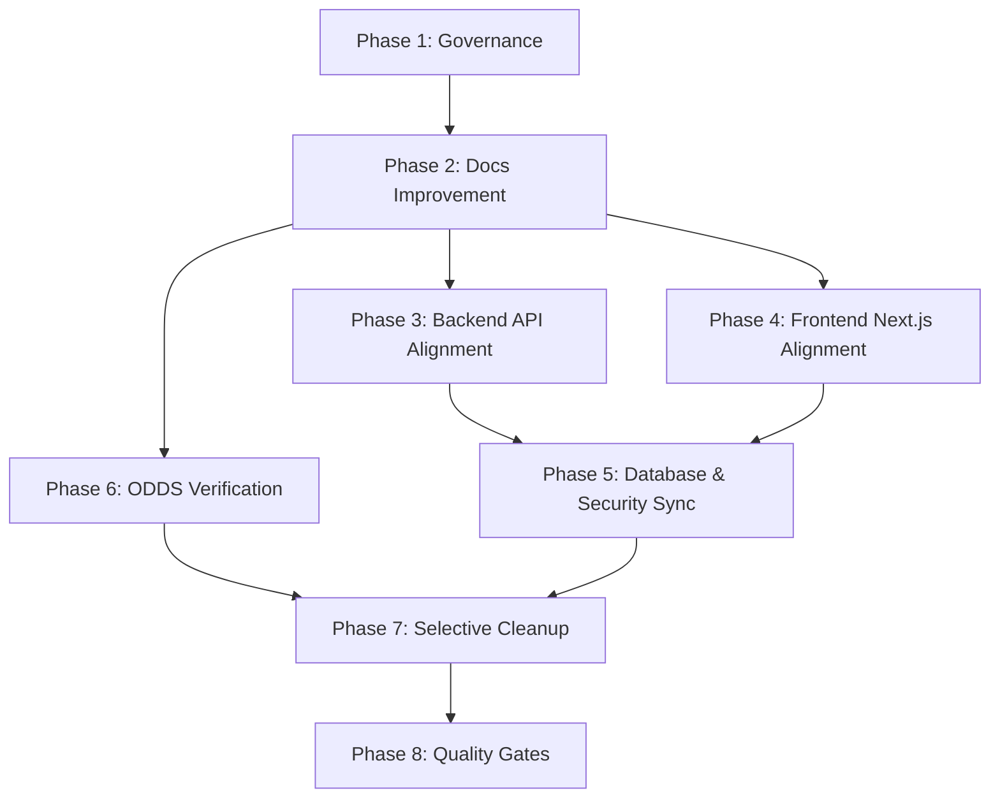

# Creative Universe Enterprise Refactor Task List

## 1. Planning Summary

Berdasarkan hasil audit komprehensif pada berkas `Repository_And_Docs_Audit.md`, repositori Creative Universe dalam kondisi monorepo headless yang sangat stabil dengan backend Laravel 11 REST API dan frontend Next.js static export. Namun, transisi yang sedang berjalan menyisakan beberapa file/folder sampah (seperti folder kosong `apps/backend/apps` dan sisa `node_modules.broken` di frontend), dokumentasi dengan status DRAFT atau tanpa frontmatter standar, serta kebutuhan peninjauan khusus (seperti spasi tunggal pada `variant_name` dan dual-broadcasting Pusher vs Reverb).

Daftar tugas ini dirancang agar agen masa depan dapat melakukan eksekusi refaktor dan pembersihan secara bertahap dalam batch kecil. Strategi alokasi model yang efisien (quota-aware) diterapkan untuk menekan biaya penggunaan token tanpa mengorbankan keamanan kode.

## 2. Current Project Status

- **Monorepo Status**: `ACTIVE` (terbagi menjadi `apps/backend`, `apps/frontend`, `legacy/laravel-livewire`, dan `docs`).
- **Backend Status**: `ACTIVE` (Laravel 11 REST API).
- **Frontend Status**: `ACTIVE` (Next.js static export).
- **Docs Status**: `NEEDS_REVIEW` (terdapat beberapa berkas berstatus DRAFT atau kekurangan frontmatter standar).
- **Tests Status**: `VERIFIED_ACTIVE` (118 PHPUnit tests lulus secara lokal).
- **Cleanup Status**: `PENDING` (7 file/folder teridentifikasi sebagai kandidat pembersihan).
- **NEEDS_REVIEW Status**: `PENDING` (3 isu arsitektur dan bisnis memerlukan keputusan pemilik/evaluasi).

## 3. Quota-Aware Execution Strategy

Untuk menghemat penggunaan kuota model berbiaya tinggi (Claude Opus), strategi eksekusi diatur berdasarkan kompleksitas tugas:
- **Claude Opus** didelegasikan hanya untuk keputusan arsitektur strategis, persetujuan Project Owner, atau review akhir yang berdampak tinggi. Maksimum 2 tugas Opus dalam seluruh rangkaian rencana ini.
- **Gemini 3.1 Pro High** digunakan untuk tugas-tugas backend, database, dan security dengan risiko sedang hingga tinggi di mana kesalahan penulisan kode dapat merusak stabilitas aplikasi.
- **Gemini 3.1 Pro Low** digunakan untuk penalaran dokumentasi yang kompleks dan penulisan standar yang memerlukan konsistensi bahasa.
- **Gemini 3.5 Flash High & Medium** digunakan untuk analisis menengah, perbandingan data, pembuatan prompt eksekusi, serta normalisasi markdown.
- **Gemini 3.5 Flash Low** digunakan untuk tugas-tugas rutin berisiko rendah seperti pembersihan berkas statis, format indentasi, perbaikan typo, dan pembaruan indeks.

## 4. Model Usage Matrix

| Model | Peran Utama | Contoh Tugas | Estimasi Kuota |
|---|---|---|---|
| **Claude Opus** | Arsitek & Reviewer Akhir | Keputusan ODDS, Review Keamanan Akhir | 2 Tasks |
| **Gemini 3.1 Pro High** | Verifikasi & Implementasi Kode | Validasi Rute API, Cek Guard Web Artisan, Cek RBAC | 9 Tasks |
| **Gemini 3.1 Pro Low** | Penalaran Dokumen Kompleks | Pembaruan SRD, Klasifikasi Dokumen | 4 Tasks |
| **Gemini 3.5 Flash High** | Analisis Menengah & QA | Verifikasi Build Statis, Run Test Suite | 5 Tasks |
| **Gemini 3.5 Flash Medium** | Normalisasi & Sinkronisasi | Pengkinian Status SRD, Pembuatan Prompt | 3 Tasks |
| **Gemini 3.5 Flash Low** | Formatting & Pembersihan Ringan | Pembersihan Folder/File Sampah, Update Indeks Trash | 8 Tasks |

## 5. Task Dependency Map



## 6. Master Task List

| Task ID | Phase | Title | Model | Risk | Status |
|---|---|---|---|---|---|
| `GOV-001` | Phase 1 | Verifikasi Aturan Source of Truth | Gemini 3.1 Pro Low | LOW | PENDING |
| `GOV-002` | Phase 1 | Standar Label Status Dokumentasi | Gemini 3.5 Flash Medium| LOW | PENDING |
| `DOC-001` | Phase 2 | Klasifikasi dan Penataan Dokumen | Gemini 3.1 Pro Low | LOW | PENDING |
| `DOC-002` | Phase 2 | Pengkinian Status SRD API & Frontend | Gemini 3.5 Flash Medium| LOW | PENDING |
| `API-001` | Phase 3 | Verifikasi Peta Rute API Backend | Gemini 3.1 Pro High | MEDIUM | PENDING |
| `API-002` | Phase 3 | Audit Keamanan Web Artisan | Gemini 3.1 Pro High | HIGH | PENDING |
| `API-003` | Phase 3 | Verifikasi Logika Controller & Service | Gemini 3.1 Pro High | MEDIUM | PENDING |
| `FE-001` | Phase 4 | Verifikasi Status Next.js Static Export| Gemini 3.1 Pro High | MEDIUM | PENDING |
| `FE-002` | Phase 4 | Audit Integrasi API Client Frontend | Gemini 3.1 Pro High | MEDIUM | PENDING |
| `FE-003` | Phase 4 | Audit Auth State & Route Guard | Gemini 3.1 Pro High | MEDIUM | PENDING |
| `DB-001` | Phase 5 | Verifikasi Migrasi Database & ERD | Gemini 3.1 Pro High | HIGH | PENDING |
| `SEC-001` | Phase 5 | Audit Kebijakan RBAC & Gate | Gemini 3.1 Pro High | HIGH | PENDING |
| `SEC-002` | Phase 5 | Investigasi Dual Broadcasting | Gemini 3.1 Pro High | MEDIUM | PENDING |
| `ODDS-001`| Phase 6 | Audit Migrasi & Model ODDS | Gemini 3.1 Pro High | MEDIUM | PENDING |
| `ODDS-002`| Phase 6 | Verifikasi Rute & Controller ODDS | Gemini 3.1 Pro High | MEDIUM | PENDING |
| `ODDS-003`| Phase 6 | Verifikasi Unit/Feature Test ODDS | Gemini 3.5 Flash High | LOW | PENDING |
| `ODDS-004`| Phase 6 | Pengkinian Metadata Dokumen ODDS | Gemini 3.1 Pro Low | LOW | PENDING |
| `REV-001` | Phase 6 | Konfirmasi Status ODDS ke Project Owner| Claude Opus | LOW | PENDING |
| `CLN-001` | Phase 7 | Pembersihan Folder backend/apps | Gemini 3.5 Flash Low | LOW | PENDING |
| `CLN-002` | Phase 7 | Pembersihan frontend/node_modules.broken| Gemini 3.5 Flash Low | LOW | PENDING |
| `CLN-003` | Phase 7 | Pembersihan DB Produk Sementara.csv | Gemini 3.5 Flash Low | LOW | PENDING |
| `CLN-004` | Phase 7 | Pembersihan docs/brainstromming ODDS.md| Gemini 3.5 Flash Low | LOW | PENDING |
| `CLN-005` | Phase 7 | Penanganan Berkas Windows apps/backend/nul| Gemini 3.5 Flash High| MEDIUM | PENDING |
| `CLN-006` | Phase 7 | Pembersihan PHPUnit Cache | Gemini 3.5 Flash Low | LOW | PENDING |
| `CLN-007` | Phase 7 | Pembersihan TypeScript Build Cache | Gemini 3.5 Flash Low | LOW | PENDING |
| `QA-001` | Phase 8 | Validasi Code Style Backend | Gemini 3.5 Flash Low | LOW | PENDING |
| `QA-002` | Phase 8 | Eksekusi Test Suite & Peta Rute API | Gemini 3.5 Flash High | LOW | PENDING |
| `QA-003` | Phase 8 | Linting & Typecheck Frontend | Gemini 3.5 Flash High | LOW | PENDING |
| `QA-004` | Phase 8 | Validasi Build Statis Frontend | Gemini 3.5 Flash High | MEDIUM | PENDING |
| `QA-005` | Phase 8 | Final Keamanan & Arsitektur Review | Claude Opus | HIGH | PENDING |

---

## 7. Phase 1 — Governance and Source of Truth

### GOV-001: Verifikasi Aturan Source of Truth
* **Phase**: Phase 1 — Governance and Source of Truth
* **Title**: Verifikasi Aturan Source of Truth
* **Description**: Melakukan tinjauan aturan urutan prioritas kebenaran data pada `docs/README.md` dan membandingkannya dengan ADR-001 sampai ADR-007 guna memastikan tidak ada inkonsistensi hirarki dokumen.
* **Recommended Model**: Gemini 3.1 Pro Low
* **Reason for Model**: Memerlukan analisis kontekstual teks dokumentasi yang menyeluruh.
* **Risk Level**: LOW
* **Dependencies**: None
* **Local Files**: [README.md](file:///c:/laragon/www/creativeuniverse/docs/README.md), [Architecture_Decision_Log.md](file:///c:/laragon/www/creativeuniverse/docs/00_architecture/Architecture_Decision_Log.md)
* **Expected Output**: Terkonfirmasinya urutan prioritas kebenaran dokumentasi yang sinkron dengan ADR.
* **Acceptance Criteria**: Dokumen `docs/README.md` secara eksplisit mencantumkan hirarki yang disetujui tanpa ada kontradiksi dengan log ADR.
* **Rollback Note**: N/A

### GOV-002: Standar Label Status Dokumentasi
* **Phase**: Phase 1 — Governance and Source of Truth
* **Title**: Standar Label Status Dokumentasi
* **Description**: Memastikan tujuh status resmi dokumentasi (`ACTIVE`, `VERIFIED_ACTIVE`, `TARGET`, `LEGACY`, `DEPRECATED`, `ARCHIVED`, `NEEDS_REVIEW`) didefinisikan secara eksplisit di berkas terminologi global.
* **Recommended Model**: Gemini 3.5 Flash Medium
* **Reason for Model**: Tugas pembaruan dokumentasi terstruktur standar.
* **Risk Level**: LOW
* **Dependencies**: `GOV-001`
* **Local Files**: [Terminology_and_Conventions.md](file:///c:/laragon/www/creativeuniverse/docs/00_architecture/Terminology_and_Conventions.md)
* **Expected Output**: Tabel definisi label status pada dokumen terminologi.
* **Acceptance Criteria**: Berkas terminologi memuat tabel definisi lengkap tujuh status label tersebut beserta contoh penerapannya.
* **Rollback Note**: N/A

---

## 8. Phase 2 — Enterprise Documentation Improvement

### DOC-001: Klasifikasi dan Penataan Dokumen
* **Phase**: Phase 2 — Enterprise Documentation Improvement
* **Title**: Klasifikasi dan Penataan Dokumen
* **Description**: Melakukan audit status pada seluruh file markdown di folder `docs/` dan membandingkannya dengan kenyataan kode untuk merapikan indeks global.
* **Recommended Model**: Gemini 3.1 Pro Low
* **Reason for Model**: Memerlukan pemahaman menyeluruh atas struktur repositori dokumen dan kode.
* **Risk Level**: LOW
* **Dependencies**: `GOV-002`
* **Local Files**: Folder `docs/` secara keseluruhan.
* **Expected Output**: Pembaruan file [README.md](file:///c:/laragon/www/creativeuniverse/docs/README.md) di root dan `docs/` dengan klasifikasi status terbaru.
* **Acceptance Criteria**: Seluruh tautan dokumen di indeks terklasifikasi berdasarkan status terbaru yang akurat.
* **Rollback Note**: N/A

### DOC-002: Pengkinian Status SRD API & Frontend
* **Phase**: Phase 2 — Enterprise Documentation Improvement
* **Title**: Pengkinian Status SRD API & Frontend
* **Description**: Mengubah status metadata YAML frontmatter dari `DRAFT` menjadi `ACTIVE` atau `APPROVED` pada dokumen spesifikasi API dan Next.js karena fitur-fitur tersebut telah berhasil diimplementasikan di M7.
* **Recommended Model**: Gemini 3.5 Flash Medium
* **Reason for Model**: Modifikasi terstruktur pada metadata markdown.
* **Risk Level**: LOW
* **Dependencies**: `DOC-001`
* **Local Files**: [Laravel_REST_API_SRD.md](file:///c:/laragon/www/creativeuniverse/docs/03_backend_api/Laravel_REST_API_SRD.md), [NextJS_Frontend_SRD.md](file:///c:/laragon/www/creativeuniverse/docs/04_frontend_nextjs/NextJS_Frontend_SRD.md)
* **Expected Output**: Frontmatter kedua file diperbarui dengan status `ACTIVE` / `APPROVED`.
* **Acceptance Criteria**: Baris status di YAML metadata masing-masing file bernilai `ACTIVE` atau `APPROVED`.
* **Rollback Note**: Kembalikan status metadata ke `DRAFT` jika terjadi pembatalan milestones.

---

## 9. Phase 3 — Backend Laravel API Alignment

### API-001: Verifikasi Peta Rute API Backend
* **Phase**: Phase 3 — Backend Laravel API Alignment
* **Title**: Verifikasi Peta Rute API Backend
* **Description**: Membandingkan rute aktual di `apps/backend/routes/api.php` dengan yang terdokumentasi di `Laravel_REST_API_SRD.md`.
* **Recommended Model**: Gemini 3.1 Pro High
* **Reason for Model**: Tugas verifikasi silang kritis yang sensitif terhadap keamanan rute.
* **Risk Level**: MEDIUM
* **Dependencies**: `DOC-002`
* **Local Files**: [api.php](file:///c:/laragon/www/creativeuniverse/apps/backend/routes/api.php), [Laravel_REST_API_SRD.md](file:///c:/laragon/www/creativeuniverse/docs/03_backend_api/Laravel_REST_API_SRD.md)
* **Expected Output**: Laporan verifikasi rute dan pembaruan kontrak jika ditemukan deviasi.
* **Acceptance Criteria**: Seluruh rute aktif di kode terpetakan 1-ke-1 dengan SRD tanpa ada rute tersembunyi.
* **Rollback Note**: N/A

### API-002: Audit Keamanan Web Artisan
* **Phase**: Phase 3 — Backend Laravel API Alignment
* **Title**: Audit Keamanan Web Artisan
* **Description**: Memastikan pembatasan token (`ARTISAN_SECRET`), IP whitelist, log aktivitas (`activity_log`), dan blokade environment `production` berjalan 100% aman pada `web_artisan.php`.
* **Recommended Model**: Gemini 3.1 Pro High
* **Reason for Model**: Cek keamanan kritis backend (IP whitelist & environment guard).
* **Risk Level**: HIGH
* **Dependencies**: `API-001`
* **Local Files**: [web_artisan.php](file:///c:/laragon/www/creativeuniverse/apps/backend/routes/web_artisan.php), [ArtisanTokenMiddleware.php](file:///c:/laragon/www/creativeuniverse/apps/backend/app/Http/Middleware/ArtisanTokenMiddleware.php)
* **Expected Output**: Hasil audit middleware keamanan dan log verifikasi uji coba pemblokiran.
* **Acceptance Criteria**: Pengujian request tanpa header/token mengembalikan HTTP 401/403, dan eksekusi command destruktif diblokir di environment non-local.
* **Rollback Note**: Jangan mengubah middleware kecuali atas dasar temuan celah keamanan yang terkonfirmasi.

### API-003: Verifikasi Logika Controller & Service
* **Phase**: Phase 3 — Backend Laravel API Alignment
* **Title**: Verifikasi Logika Controller & Service
* **Description**: Memastikan Controller tipis (tidak memuat business rules yang rumit) dan mendelegasikan mutasi data ke Action/Service Layer.
* **Recommended Model**: Gemini 3.1 Pro High
* **Reason for Model**: Membutuhkan pemahaman mendalam tentang arsitektur perangkat lunak Laravel.
* **Risk Level**: MEDIUM
* **Dependencies**: `API-001`
* **Local Files**: Folder `app/Http/Controllers/Api/`, `app/Services/`, `app/Actions/`
* **Expected Output**: Laporan kepatuhan arsitektur backend.
* **Acceptance Criteria**: Mutasi database tidak terjadi langsung di dalam Controller.
* **Rollback Note**: N/A

---

## 10. Phase 4 — Frontend Next.js Alignment

### FE-001: Verifikasi Status Next.js Static Export
* **Phase**: Phase 4 — Frontend Next.js Alignment
* **Title**: Verifikasi Status Next.js Static Export
* **Description**: Memverifikasi file `next.config.ts` untuk memastikan tidak ada fitur SSR, ISR, Server Actions, atau route handler lokal yang diaktifkan secara tidak sengaja.
* **Recommended Model**: Gemini 3.1 Pro High
* **Reason for Model**: Verifikasi konfigurasi build statis Next.js.
* **Risk Level**: MEDIUM
* **Dependencies**: `DOC-002`
* **Local Files**: [next.config.ts](file:///c:/laragon/www/creativeuniverse/apps/frontend/next.config.ts)
* **Expected Output**: Laporan status kecocokan konfigurasi ekspor statis.
* **Acceptance Criteria**: Properti `output` bernilai `'export'`, properti `images.unoptimized` bernilai `true`.
* **Rollback Note**: Kembalikan setelan ekspor statis jika terjadi kegagalan build.

### FE-002: Audit Integrasi API Client Frontend
* **Phase**: Phase 4 — Frontend Next.js Alignment
* **Title**: Audit Integrasi API Client Frontend
* **Description**: Memastikan seluruh request data-fetching frontend mengarah ke relative path `/api/v1` via class `apiFetch` dan cookie secure ditransmisikan.
* **Recommended Model**: Gemini 3.1 Pro High
* **Reason for Model**: Mengaudit kode jaringan client-side terhadap Sanctum CSRF.
* **Risk Level**: MEDIUM
* **Dependencies**: `FE-001`
* **Local Files**: [api.ts](file:///c:/laragon/www/creativeuniverse/apps/frontend/src/lib/api.ts)
* **Expected Output**: Laporan audit data fetching.
* **Acceptance Criteria**: Request menggunakan method non-GET menyertakan header `X-XSRF-TOKEN` secara konsisten.
* **Rollback Note**: N/A

### FE-003: Audit Auth State & Route Guard
* **Phase**: Phase 4 — Frontend Next.js Alignment
* **Title**: Audit Auth State & Route Guard
* **Description**: Meninjau alur proteksi rute di client-side menggunakan `RouteGuard` yang tersinkronisasi dengan API `auth/me` untuk mencegah kebocoran halaman statis privat.
* **Recommended Model**: Gemini 3.1 Pro High
* **Reason for Model**: Penanganan routing keamanan kritis client-side Next.js.
* **Risk Level**: MEDIUM
* **Dependencies**: `FE-002`
* **Local Files**: [auth-provider.tsx](file:///c:/laragon/www/creativeuniverse/apps/frontend/src/providers/auth-provider.tsx), [route-guard.tsx](file:///c:/laragon/www/creativeuniverse/apps/frontend/src/components/route-guard.tsx)
* **Expected Output**: Laporan kepatuhan security guard client-side.
* **Acceptance Criteria**: Halaman privat dialihkan ke `/login` saat session status bernilai unauthenticated.
* **Rollback Note**: N/A

---

## 11. Phase 5 — Database, ERD, and Security Sync

### DB-001: Verifikasi Migrasi Database & ERD
* **Phase**: Phase 5 — Database, ERD, and Security Sync
* **Title**: Verifikasi Migrasi Database & ERD
* **Description**: Membandingkan skema migrasi database aktual di `database/migrations` terhadap representasi visual di dokumen ERD Core.
* **Recommended Model**: Gemini 3.1 Pro High
* **Reason for Model**: Kompleksitas tinggi pemetaan skema database.
* **Risk Level**: HIGH
* **Dependencies**: `API-001`, `FE-001`
* **Local Files**: Folder `database/migrations/`, [CreativeUniverse-MainApp_ERD.md](file:///c:/laragon/www/creativeuniverse/docs/01_core_system/CreativeUniverse-MainApp_ERD.md)
* **Expected Output**: Laporan deviasi ERD vs kode migrasi aktual.
* **Acceptance Criteria**: Seluruh tabel, tipe data, dan kunci asing (FK) terpetakan akurat di ERD.
* **Rollback Note**: Jangan mengubah berkas migrasi lama yang sudah dideploy.

### SEC-001: Audit Kebijakan RBAC & Gate
* **Phase**: Phase 5 — Database, ERD, and Security Sync
* **Title**: Audit Kebijakan RBAC & Gate
* **Description**: Melakukan audit implementasi otorisasi (Gate/Policy/Spatie) di backend untuk memastikan Manajer tidak dapat mengelola akun Root atau memberikan role Root.
* **Recommended Model**: Gemini 3.1 Pro High
* **Reason for Model**: Verifikasi celah otorisasi keamanan RBAC yang kritis.
* **Risk Level**: HIGH
* **Dependencies**: `DB-001`
* **Local Files**: [UserPolicy.php](file:///c:/laragon/www/creativeuniverse/apps/backend/app/Policies/UserPolicy.php) (atau sejenis), [AppServiceProvider.php](file:///c:/laragon/www/creativeuniverse/apps/backend/app/Providers/AppServiceProvider.php)
* **Expected Output**: Laporan kelulusan verifikasi boundary otorisasi.
* **Acceptance Criteria**: Unit test khusus hierarchy RBAC lulus tanpa celah privilege escalation.
* **Rollback Note**: N/A

### SEC-002: Investigasi Dual Broadcasting
* **Phase**: Phase 5 — Database, ERD, and Security Sync
* **Title**: Investigasi Dual Broadcasting
* **Description**: Meneliti alasan mengapa Reverb dan Pusher terkonfigurasi bersamaan pada berkas `.env` dan memastikan client Echo terhubung ke driver penyiaran yang tepat tanpa mengalami interferensi pesan ganda.
* **Recommended Model**: Gemini 3.1 Pro High
* **Reason for Model**: Penanganan masalah dual-broadcasting driver pada lingkungan hibrida.
* **Risk Level**: MEDIUM
* **Dependencies**: `FE-002`
* **Local Files**: [.env](file:///c:/laragon/www/creativeuniverse/apps/backend/.env), [broadcasting.php](file:///c:/laragon/www/creativeuniverse/apps/backend/config/broadcasting.php), [echo.ts](file:///c:/laragon/www/creativeuniverse/apps/frontend/src/lib/echo.ts)
* **Expected Output**: Rekomendasi penyelarasan konfigurasi websocket.
* **Acceptance Criteria**: Terpilihnya satu driver penyiaran utama (default: Pusher) dan nonaktifnya konfigurasi driver sekunder yang tidak digunakan di production.
* **Rollback Note**: Simpan cadangan konfigurasi Echo lama sebelum melakukan perubahan driver.

---

## 12. Phase 6 — ODDS Verification

### ODDS-001: Audit Migrasi & Model ODDS
* **Phase**: Phase 6 — ODDS Verification
* **Title**: Audit Migrasi & Model ODDS
* **Description**: Meninjau file migrasi workflow ODDS `2026_06_26_000000_create_odds_workflow_tables.php` dan file model terkait di folder `app/Models/Odds/` untuk memverifikasi kesesuaian relasi database.
* **Recommended Model**: Gemini 3.1 Pro High
* **Reason for Model**: Audit relasi database dan model sub-aplikasi baru.
* **Risk Level**: MEDIUM
* **Dependencies**: `DB-001`
* **Local Files**: Migrasi ODDS, folder `app/Models/Odds/`
* **Expected Output**: Laporan kecocokan model dan skema ODDS.
* **Acceptance Criteria**: Relasi database terwakili secara tepat di model Eloquent tanpa ada circular reference.
* **Rollback Note**: N/A

### ODDS-002: Verifikasi Rute & Controller ODDS
* **Phase**: Phase 6 — ODDS Verification
* **Title**: Verifikasi Rute & Controller ODDS
* **Description**: Menyelidiki controller ODDS di `app/Http/Controllers/Api/Odds/` untuk memastikan bahwa semua endpoint terproteksi oleh middleware `can:access-odds` dan policy otorisasi yang sesuai.
* **Recommended Model**: Gemini 3.1 Pro High
* **Reason for Model**: Audit otorisasi modular endpoint baru.
* **Risk Level**: MEDIUM
* **Dependencies**: `ODDS-001`
* **Local Files**: [api.php](file:///c:/laragon/www/creativeuniverse/apps/backend/routes/api.php), folder `app/Http/Controllers/Api/Odds/`
* **Expected Output**: Laporan kepatuhan otorisasi ODDS.
* **Acceptance Criteria**: Seluruh endpoint ODDS menolak request dari pengguna biasa yang tidak memiliki izin akses khusus ODDS.
* **Rollback Note**: N/A

### ODDS-003: Verifikasi Unit/Feature Test ODDS
* **Phase**: Phase 6 — ODDS Verification
* **Title**: Verifikasi Unit/Feature Test ODDS
* **Description**: Menjalankan pengujian fungsional ODDS secara lokal menggunakan `php artisan test --filter=Odds` untuk mengonfirmasi kelulusan tes.
* **Recommended Model**: Gemini 3.5 Flash High
* **Reason for Model**: Pemanggilan perintah test runner otomatis berisiko rendah.
* **Risk Level**: LOW
* **Dependencies**: `ODDS-002`
* **Local Files**: [OddsWorkflowApiTest.php](file:///c:/laragon/www/creativeuniverse/apps/backend/tests/Feature/Api/OddsWorkflowApiTest.php)
* **Expected Output**: Output konsol pengujian dengan hasil 100% pass.
* **Acceptance Criteria**: Tidak ada kegagalan asersi pada seluruh tes ODDS.
* **Rollback Note**: N/A

### ODDS-004: Pengkinian Metadata Dokumen ODDS
* **Phase**: Phase 6 — ODDS Verification
* **Title**: Pengkinian Metadata Dokumen ODDS
* **Description**: Menambahkan YAML frontmatter terstandar pada berkas dokumentasi ODDS untuk menyelaraskannya dengan konvensi global.
* **Recommended Model**: Gemini 3.1 Pro Low
* **Reason for Model**: Penyesuaian metadata dokumentasi yang teliti.
* **Risk Level**: LOW
* **Dependencies**: `DOC-002`, `ODDS-003`
* **Local Files**: [CreativeUniverse-SubApp_ODDS_SRD.md](file:///c:/laragon/www/creativeuniverse/docs/06_odds/CreativeUniverse-SubApp_ODDS_SRD.md), [CreativeUniverse-SubApp_ODDS_ERD.md](file:///c:/laragon/www/creativeuniverse/docs/06_odds/CreativeUniverse-SubApp_ODDS_ERD.md)
* **Expected Output**: Dokumen ODDS yang telah diperbarui frontmatter-nya.
* **Acceptance Criteria**: Berkas memiliki metadata title, status, version, dan revised di baris paling atas.
* **Rollback Note**: N/A

### REV-001: Konfirmasi Status ODDS ke Project Owner
* **Phase**: Phase 6 — ODDS Verification
* **Title**: Konfirmasi Status ODDS ke Project Owner
* **Description**: Menanyakan konfirmasi status ODDS kepada Project Owner (apakah ODDS dinyatakan sah sebagai modul aktif, target berikutnya, atau perlu penyesuaian).
* **Recommended Model**: Claude Opus
* **Reason for Model**: Memerlukan penyelesaian pengambilan keputusan tingkat tinggi (Review Gate).
* **Risk Level**: LOW
* **Dependencies**: `ODDS-004`
* **Local Files**: [Repository_And_Docs_Audit.md](file:///c:/laragon/www/creativeuniverse/docs/99_cleanup/Repository_And_Docs_Audit.md)
* **Expected Output**: Keputusan tertulis resmi dari Project Owner mengenai integrasi ODDS.
* **Acceptance Criteria**: Masukan project owner diterima dan dicatat di log keputusan.
* **Rollback Note**: N/A

---

## 13. Phase 7 — Selective Cleanup and Trash Movement

Setiap pembersihan harus dilakukan secara selektif dengan memindahkan berkas kandidat ke dalam folder `trash/YYYY-MM-DD/` di root workspace, serta memperbarui indeks trash.

### CLN-001: Pembersihan Folder backend/apps
* **Phase**: Phase 7 — Selective Cleanup and Trash Movement
* **Title**: Pembersihan Folder backend/apps
* **Description**: Memindahkan folder kosong keliru `apps/backend/apps` ke `trash/YYYY-MM-DD/junk-folder/` dan memperbarui Trash Index.
* **Recommended Model**: Gemini 3.5 Flash Low
* **Reason for Model**: Tugas pembersihan folder kosong berisiko sangat rendah.
* **Risk Level**: LOW
* **Dependencies**: `REV-001`
* **Local Files**: `apps/backend/apps`
* **Expected Output**: Folder dipindahkan secara aman.
* **Acceptance Criteria**: Folder `apps/backend/apps` tidak lagi ada di backend.
* **Rollback Note**: Kembalikan folder dari trash jika diperlukan.

### CLN-002: Pembersihan frontend/node_modules.broken
* **Phase**: Phase 7 — Selective Cleanup and Trash Movement
* **Title**: Pembersihan frontend/node_modules.broken
* **Description**: Memindahkan folder sisa build rusak `apps/frontend/node_modules.broken` ke `trash/YYYY-MM-DD/build-artifacts/` secara aman.
* **Recommended Model**: Gemini 3.5 Flash Low
* **Reason for Model**: Pembersihan folder dependensi sisa berbiaya rendah.
* **Risk Level**: LOW
* **Dependencies**: `FE-001`
* **Local Files**: `apps/frontend/node_modules.broken`
* **Expected Output**: Folder dipindahkan secara aman.
* **Acceptance Criteria**: Folder `node_modules.broken` terhapus dari frontend.
* **Rollback Note**: Simpan cadangan jika terjadi masalah compiler tailwind pasca-hapus.

### CLN-003: Pembersihan DB Produk Sementara.csv
* **Phase**: Phase 7 — Selective Cleanup and Trash Movement
* **Title**: Pembersihan DB Produk Sementara.csv
* **Description**: Memindahkan berkas CSV temporer pengujian `DB Produk Sementara.csv` ke `trash/YYYY-MM-DD/temp-files/`.
* **Recommended Model**: Gemini 3.5 Flash Low
* **Reason for Model**: Pembersihan berkas data statis sisa uji coba.
* **Risk Level**: LOW
* **Dependencies**: `DB-001`
* **Local Files**: `DB Produk Sementara.csv`
* **Expected Output**: Berkas CSV dipindahkan.
* **Acceptance Criteria**: Berkas hilang dari root workspace.
* **Rollback Note**: Pindahkan kembali file dari folder trash jika diperlukan data referensinya.

### CLN-004: Pembersihan docs/brainstromming ODDS.md
* **Phase**: Phase 7 — Selective Cleanup and Trash Movement
* **Title**: Pembersihan docs/brainstromming ODDS.md
* **Description**: Memindahkan berkas draf ide awal `docs/brainstromming ODDS.md` ke folder `trash/YYYY-MM-DD/duplicate-docs/`.
* **Recommended Model**: Gemini 3.5 Flash Low
* **Reason for Model**: Pembersihan dokumentasi draf nonaktif.
* **Risk Level**: LOW
* **Dependencies**: `REV-001`, `ODDS-004`
* **Local Files**: `docs/brainstromming ODDS.md`
* **Expected Output**: Berkas dipindahkan secara aman.
* **Acceptance Criteria**: Berkas tidak lagi berada di root folder `docs/`.
* **Rollback Note**: Pulihkan file jika ada ide brainstorming yang terlewat dari SRD.

### CLN-005: Penanganan Berkas Windows apps/backend/nul
* **Phase**: Phase 7 — Selective Cleanup and Trash Movement
* **Title**: Penanganan Berkas Windows apps/backend/nul
* **Description**: Meneliti berkas `apps/backend/nul` dan menghapusnya secara paksa menggunakan Git Bash atau perintah konsol khusus Windows yang dapat membypass penamaan sistem device.
* **Recommended Model**: Gemini 3.5 Flash High
* **Reason for Model**: Penghapusan file bernama sistem khusus Windows berisiko menengah.
* **Risk Level**: MEDIUM
* **Dependencies**: `API-003`
* **Local Files**: `apps/backend/nul`
* **Expected Output**: Berkas `nul` dihapus sepenuhnya.
* **Acceptance Criteria**: File system Windows tidak lagi mencantumkan berkas `nul` di backend.
* **Rollback Note**: Lakukan backup terisolasi folder backend sebelum penghapusan paksa.

### CLN-006: Pembersihan PHPUnit Cache
* **Phase**: Phase 7 — Selective Cleanup and Trash Movement
* **Title**: Pembersihan PHPUnit Cache
* **Description**: Memindahkan file cache pengujian `.phpunit.result.cache` ke `trash/YYYY-MM-DD/build-artifacts/` dan memasukkannya ke `.gitignore` backend.
* **Recommended Model**: Gemini 3.5 Flash Low
* **Reason for Model**: Tugas pembersihan berkas cache build.
* **Risk Level**: LOW
* **Dependencies**: None
* **Local Files**: `apps/backend/.phpunit.result.cache`
* **Expected Output**: File dipindahkan dan `.gitignore` diperbarui.
* **Acceptance Criteria**: File hilang dari folder backend dan tidak terdeteksi oleh Git status.
* **Rollback Note**: N/A

### CLN-007: Pembersihan TypeScript Build Cache
* **Phase**: Phase 7 — Selective Cleanup and Trash Movement
* **Title**: Pembersihan TypeScript Build Cache
* **Description**: Memindahkan file cache typescript `tsconfig.tsbuildinfo` ke `trash/YYYY-MM-DD/build-artifacts/` dan memasukkannya ke `.gitignore` frontend.
* **Recommended Model**: Gemini 3.5 Flash Low
* **Reason for Model**: Pembersihan berkas cache compiler statis.
* **Risk Level**: LOW
* **Dependencies**: `FE-001`
* **Local Files**: `apps/frontend/tsconfig.tsbuildinfo`
* **Expected Output**: File dipindahkan dan `.gitignore` diperbarui.
* **Acceptance Criteria**: File hilang dari folder frontend dan terabaikan oleh Git.
* **Rollback Note**: N/A

---

## 14. Phase 8 — Quality Gates

### QA-001: Validasi Code Style Backend
* **Phase**: Phase 8 — Quality Gates
* **Title**: Validasi Code Style Backend
* **Description**: Menjalankan Laravel Pint secara lokal untuk memastikan kebersihan gaya penulisan kode PHP.
* **Recommended Model**: Gemini 3.5 Flash Low
* **Reason for Model**: Eksekusi linters otomatis berbiaya sangat rendah.
* **Risk Level**: LOW
* **Dependencies**: Seluruh tugas CLN selesai.
* **Local Files**: Folder `apps/backend/`
* **Expected Output**: Laporan kelulusan Laravel Pint.
* **Acceptance Criteria**: Seluruh berkas PHP lulus standar formatting tanpa error.
* **Rollback Note**: N/A

### QA-002: Eksekusi Test Suite & Peta Rute API
* **Phase**: Phase 8 — Quality Gates
* **Title**: Eksekusi Test Suite & Peta Rute API
* **Description**: Menjalankan seluruh pengujian backend REST API (`php artisan test`) dan membandingkannya kembali dengan route list untuk memastikan tidak ada perubahan merusak (breaking changes) pasca pembersihan.
* **Recommended Model**: Gemini 3.5 Flash High
* **Reason for Model**: Runner test suite global.
* **Risk Level**: LOW
* **Dependencies**: `QA-001`
* **Local Files**: Folder `apps/backend/tests/`
* **Expected Output**: Output konsol test suite menyatakan 100% passed.
* **Acceptance Criteria**: Semua tes lulus tanpa ada kegagalan asersi.
* **Rollback Note**: N/A

### QA-003: Linting & Typecheck Frontend
* **Phase**: Phase 8 — Quality Gates
* **Title**: Linting & Typecheck Frontend
* **Description**: Mengeksekusi command `npm run lint` dan verifikasi TypeScript pada frontend Next.js.
* **Recommended Model**: Gemini 3.5 Flash High
* **Reason for Model**: Verifikasi kode statis frontend.
* **Risk Level**: LOW
* **Dependencies**: Seluruh tugas CLN selesai.
* **Local Files**: Folder `apps/frontend/`
* **Expected Output**: Output konsol menyatakan 0 error/warning.
* **Acceptance Criteria**: Lolos tanpa ada error linter atau type checking.
* **Rollback Note**: N/A

### QA-004: Validasi Build Statis Frontend
* **Phase**: Phase 8 — Quality Gates
* **Title**: Validasi Build Statis Frontend
* **Description**: Membangun rilis produksi Next.js dengan perintah `npm run build` untuk memverifikasi pembentukan folder `out/` yang steril dari error SSR.
* **Recommended Model**: Gemini 3.5 Flash High
* **Reason for Model**: Runner compile build Next.js.
* **Risk Level**: MEDIUM
* **Dependencies**: `QA-003`
* **Local Files**: Folder `apps/frontend/`
* **Expected Output**: Hasil build statis Next.js di folder `out/`.
* **Acceptance Criteria**: Build berhasil diekspor tanpa ada runtime dependencies warning.
* **Rollback Note**: N/A

### QA-005: Final Keamanan & Arsitektur Review
* **Phase**: Phase 8 — Quality Gates
* **Title**: Final Keamanan & Arsitektur Review
* **Description**: Melakukan review akhir terhadap integritas keamanan monorepo, file `.env` contoh, dan status log keputusan arsitektur (ADR).
* **Recommended Model**: Claude Opus
* **Reason for Model**: Strategi validasi arsitektural tingkat tinggi sebelum penutupan fase.
* **Risk Level**: HIGH
* **Dependencies**: `QA-002`, `QA-004`
* **Local Files**: Seluruh repositori aktif.
* **Expected Output**: Laporan akhir UAT sign-off dan persetujuan penutupan tugas refaktor.
* **Acceptance Criteria**: Seluruh repositori dinyatakan bersih, aman, dan siap rilis.
* **Rollback Note**: N/A

---

## 15. NEEDS_REVIEW Register

Berikut adalah daftar isu tidak jelas hasil audit yang dilarang dieksekusi secara buta:
1. **Penerapan variant_name spasi tunggal `" "`**:
   Mencegah tabrakan visual antara default variant dengan variant berlabel kosong. Otoritas penanganan spasi tunggal ini harus disinkronkan agar frontend tidak menampilkan teks kosong atau spasi aneh di UI.
2. **Keabsahan Modul ODDS**:
   Apakah ODDS secara resmi diintegrasikan sekarang atau ditunda setelah peluncuran pricetag stabil. Konfirmasi tertulis project owner wajib didapatkan melalui tugas `REV-001`.
3. **Pilihan Broadcaster Utama**:
   Dual konfigurasi Pusher dan Reverb berpotensi menimbulkan tumpang tindih alur notifikasi realtime. Direkomendasikan untuk meninjau secara tegas driver mana yang akan dinonaktifkan di production.

## 16. Recommended Execution Batches

1. **Batch 1: Governance & Statusing** (`GOV-001`, `GOV-002`, `DOC-001`, `DOC-002`)
   - Fokus: Perbaikan metadata dokumen, status rujukan, dan label standarisasi.
2. **Batch 2: ODDS Verification** (`ODDS-001`, `ODDS-002`, `ODDS-003`, `ODDS-004`, `REV-001`)
   - Fokus: Verifikasi kesiapan modul ODDS dan persetujuan project owner.
3. **Batch 3: Code & Config Verification** (`API-001`, `API-002`, `API-003`, `FE-001`, `FE-002`, `FE-003`, `DB-001`, `SEC-001`, `SEC-002`)
   - Fokus: Penyelarasan rute API, middleware, otorisasi RBAC, dan penyiaran realtime.
4. **Batch 4: Selective Cleanup** (`CLN-001` s.d `CLN-007`)
   - Fokus: Pemindahan folder dan berkas sampah secara aman ke folder trash.
5. **Batch 5: Quality Gate Validate** (`QA-001` s.d `QA-005`)
   - Fokus: Linting, compiler build, full test run, dan review arsitektur akhir.

## 17. Recommended Execution Prompts Per Model

### Claude Opus Strategic Review Prompt
```text
Lakukan verifikasi tingkat tinggi terhadap dokumen keputusan arsitektur (ADR-001 s.d ADR-007) terhadap implementasi RBAC (UserPolicy) dan integrasi ODDS. Pastikan batasan same-origin, stateful cookie, serta keamanan endpoint Web Artisan tidak memiliki celah keamanan. Jangan memodifikasi file, berikan laporan analisis arsitektur terperinci.
```

### Gemini 3.1 Pro High Code Verification Prompt
```text
Verifikasi keselarasan antara rute aktual di apps/backend/routes/api.php dengan kontrak REST API SRD. Pastikan seluruh middleware otorisasi RBAC, penanganan variant_name spasi tunggal, dan perlindungan endpoint Web Artisan telah berjalan sesuai dengan spesifikasi teknis tanpa deviasi.
```

### Gemini 3.1 Pro Low Documentation Reasoning Prompt
```text
Lakukan klasifikasi dan penataan ulang seluruh file dokumentasi markdown pada folder docs/ berdasarkan status aktif terbarunya. Terapkan YAML frontmatter standar pada setiap dokumen modul ODDS dan perbarui indeks README utama agar sinkron dengan status audit terbaru.
```

### Gemini 3.5 Flash High QA Runner Prompt
```text
Jalankan pengujian otomatis PHPUnit backend (php artisan test), dan verifikasi kelulusan typecheck serta linter frontend (npm run lint). Laporkan jika ada kegagalan asersi pengujian atau peringatan linter sebelum proses build produksi dijalankan.
```

### Gemini 3.5 Flash Low Cleanup Prompt
```text
Pindahkan berkas kandidat sampah [NAMA_FILE/FOLDER] secara terisolasi ke folder trash/YYYY-MM-DD/[KATEGORI_TRASH]/. Setelah pemindahan selesai, perbarui berkas Trash_Index.md dengan mencantumkan nama berkas asli, kategori, alasan pemindahan, dan tanggal eksekusi.
```

## 18. Final Notes

- **Risiko Terbesar**: Celah otorisasi pada endpoint Web Artisan dan konflik visual/database pada variant produk pricetag.
- **Strategi Penghematan**: Gunakan model Flash (Low/Medium) untuk seluruh tugas Batch 4 (Selective Cleanup) dan Batch 1 (Governance). Simpan kuota Opus hanya untuk langkah review akhir di Batch 5.
- **Rekomendasi Aksi**: Lakukan eksekusi tugas Batch 1 terlebih dahulu untuk menyamakan baseline status dokumen sebelum menyentuh file kode.
