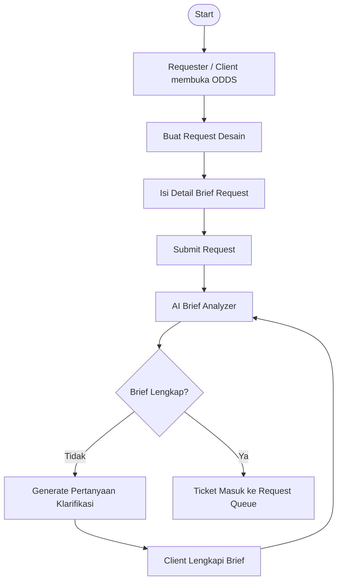
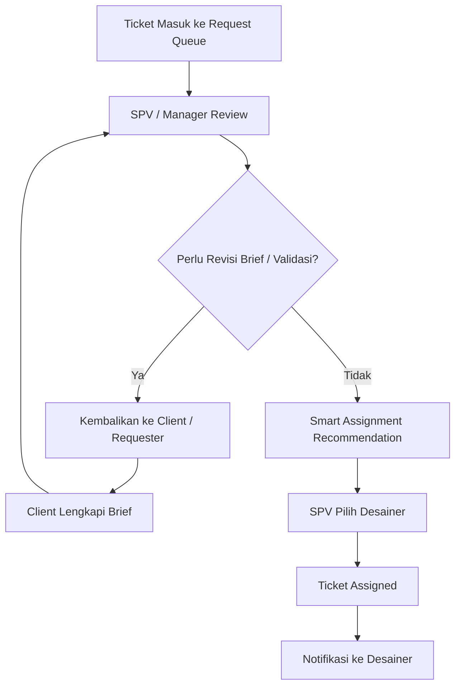
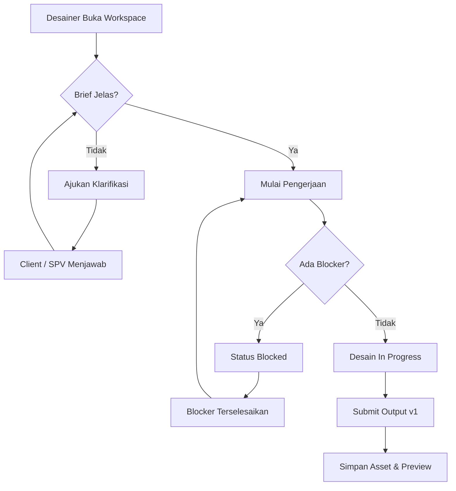
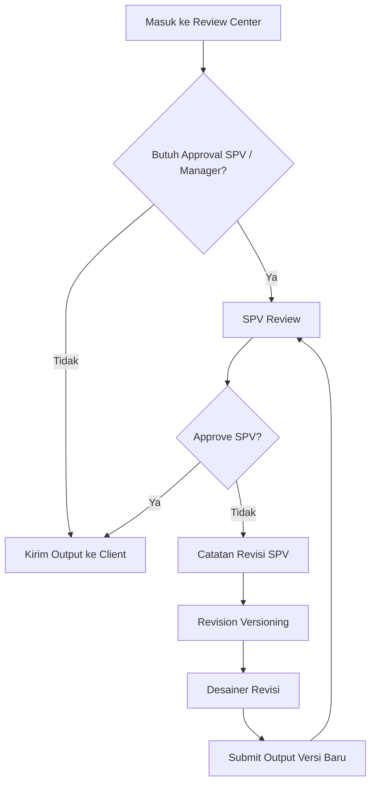
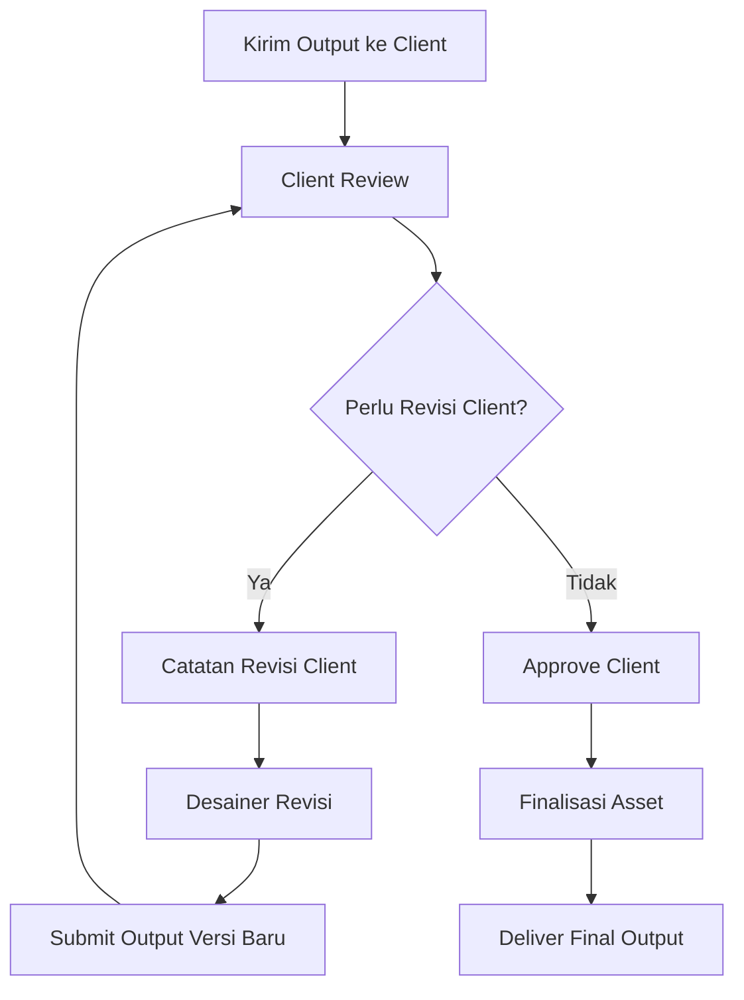
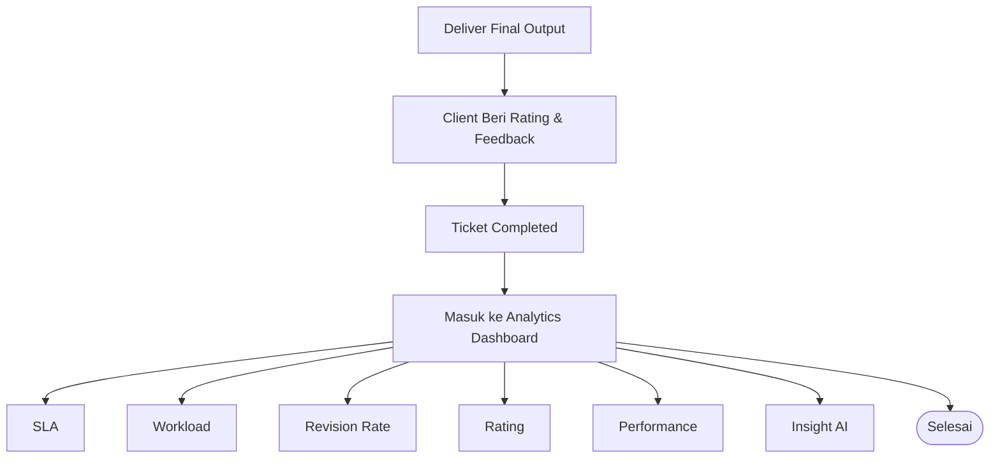

---

tags:

* creative-universe
* odds
* system-design
* srd
* workflow
* laravel-11
* nextjs
* google-ai-studio
  status: draft
  created: 2026-06-22
  module: ODDS
  title: ODDS — One Dashboard Design System

---

# ODDS — One Dashboard Design System

> [!info] Definisi
> **ODDS** adalah sistem baru untuk menggantikan workflow lama yang sebelumnya berjalan full menggunakan spreadsheet.
> Versi baru ODDS akan menjadi aplikasi penuh berbasis **Laravel 11 API**, **Next.js static frontend**, dan **Google AI Studio API**.

---

## 1. Konteks Utama

### Sistem Lama

ODDS lama berjalan dengan media utama berupa **spreadsheet**.

Spreadsheet lama berfungsi sebagai:

- tempat input request desain
- tempat memilih desainer
- tempat mencatat brief
- tempat tracking status
- tempat menyimpan link output
- tempat mencatat revisi
- tempat approval
- tempat rating client
- tempat todo harian desainer
- tempat laporan manual

### Sistem Baru

ODDS baru akan menggantikan spreadsheet sepenuhnya.

> [!success] Arah Baru
> Spreadsheet tidak lagi menjadi sistem utama.
> ODDS App menjadi pusat workflow, sedangkan spreadsheet hanya opsional untuk export/report.

---

## 2. Tech Stack Baru

| Layer             | Teknologi                                         |
| ----------------- | ------------------------------------------------- |
| Backend           | Laravel 11 API                                    |
| Frontend          | Next.js static compile                            |
| Database          | MySQL                                             |
| Auth & Permission | Laravel + Spatie Permission                       |
| AI Engine         | Google AI Studio API                              |
| Notification      | Database notification, broadcast, WhatsApp/Fonnte |
| Asset Reference   | `asset_links` polymorphic                         |
| Audit             | Activity Log                                      |

> [!warning] Catatan Penting
> API key Google AI Studio **tidak boleh** diletakkan di frontend Next.js, karena frontend static bisa dibaca dari browser. Semua request AI harus lewat Laravel backend.

---

## 3. Posisi ODDS Baru

ODDS baru bukan hanya ticketing system.

ODDS baru adalah:

> **Pusat kendali produksi desain dari request, brief, assignment, pengerjaan, approval, revisi, delivery, rating, analytics, dan AI assistance.**

ODDS memiliki 3 lapisan besar:

```text
1. Workflow System
   Request → Assign → Work → Review → Revision → Delivery → Rating

2. Control System
   SLA → Priority → Workload → Approval → Notification → Audit

3. AI Assistance System
   Brief Scoring → Summary → Checklist → Recommendation → Insight
```

---

# 4. Modul Utama ODDS

## 4.1 Dashboard

Dashboard menjadi halaman utama untuk melihat kondisi seluruh pekerjaan desain.

### Isi Dashboard

- total request masuk
- request aktif
- request selesai
- request overdue
- ticket menunggu assignment
- ticket menunggu review SPV
- ticket menunggu review client
- revisi aktif
- workload desainer
- performa bulanan
- insight AI

---

## 4.2 Request Center

Request Center adalah tempat requester/client membuat kebutuhan desain.

### Field Utama Request

| Field             | Keterangan                                          |
| ----------------- | --------------------------------------------------- |
| Kategori          | Jenis desain                                        |
| Brand             | JETE, Doran Gadget, Doran Sukses Indonesia, dll     |
| Channel           | Marketplace, social media, event, print, video, dll |
| Deadline          | Tanggal kebutuhan selesai                           |
| Prioritas         | Low, normal, high, urgent                           |
| Brief             | Deskripsi kebutuhan                                 |
| Referensi         | Link/file referensi                                 |
| Output            | Ukuran, format, atau jenis hasil akhir              |
| Approval Required | Apakah butuh approval SPV/Manager                   |

### Contoh Kategori

- Marketplace Banner
- Social Media Feed
- Story/Reels Cover
- YouTube Thumbnail
- Event Banner
- Poster
- Packaging
- Product Visual
- Motion Graphic
- Print Design

---

## 4.3 AI Brief Assistant

AI Brief Assistant membantu membaca dan menilai kualitas brief.

### Fungsi AI Brief Assistant

- membaca isi brief
- membuat ringkasan brief
- mendeteksi output yang diminta
- mendeteksi ukuran/format
- menilai kelengkapan brief
- mencari informasi yang hilang
- memberi pertanyaan klarifikasi
- memperkirakan kompleksitas pekerjaan
- memberi warning risiko revisi

### Contoh Output AI

```text
Brief Score: 72/100

Masalah:
- Ukuran desain belum disebutkan.
- Platform belum jelas.
- Copywriting final belum tersedia.
- Referensi visual belum diberikan.

Saran Pertanyaan:
1. Desain ini untuk feed, story, atau banner marketplace?
2. Apakah copywriting sudah final?
3. Apakah ada referensi visual yang ingin diikuti?
```

---

## 4.4 Brief Completeness Gate

Sebelum ticket masuk assignment, sistem mengecek apakah brief sudah cukup lengkap.

| Score  | Status                             |
| ------ | ---------------------------------- |
| 80–100 | Brief aman, bisa lanjut assignment |
| 60–79  | Bisa lanjut dengan warning         |
| <60    | Direkomendasikan minta klarifikasi |

> [!tip] Tujuan
> Mengurangi revisi karena brief tidak jelas dan melindungi desainer dari pekerjaan yang belum siap produksi.

---

## 4.5 Assignment Board

Assignment Board digunakan SPV/Manager untuk memilih desainer.

### Fitur

- melihat request queue
- melihat workload desainer
- assign manual
- rekomendasi desainer dari sistem
- filter berdasarkan kategori, deadline, prioritas
- melihat kapasitas tim
- notifikasi assignment ke desainer

### Smart Assignment Recommendation

Rekomendasi desainer dihitung berdasarkan:

- workload aktif
- jumlah ticket urgent
- deadline hari ini
- skill/kategori desain
- rating historis
- revision rate
- prioritas ticket
- estimasi kompleksitas

Contoh:

```text
Rekomendasi Desainer:
1. Ani — Match 91%
   Alasan: workload rendah, sering mengerjakan marketplace, rating tinggi.

2. Emha — Match 78%
   Alasan: tersedia hari ini, tapi sedang punya 2 ticket urgent.
```

---

## 4.6 Designer Workspace

Designer Workspace adalah halaman utama desainer.

### Isi Workspace

- ticket yang di-assign ke saya
- deadline hari ini
- revisi aktif
- request yang butuh klarifikasi
- ticket yang sedang dikerjakan
- ticket blocked
- todo otomatis
- quick action

### Quick Action

- accept ticket
- minta klarifikasi
- mulai pengerjaan
- tandai blocked
- submit output
- upload/link asset
- submit revisi

---

## 4.7 Clarification Thread

Clarification Thread menggantikan komunikasi penting yang sebelumnya tercecer di WhatsApp.

### Jenis Thread

- pertanyaan desainer ke requester
- jawaban requester
- catatan SPV
- catatan revisi
- catatan internal
- catatan final delivery

> [!note] Catatan
> WhatsApp tetap bisa dipakai sebagai notifikasi, tetapi isi workflow penting harus tercatat di ODDS.

---

## 4.8 Review Center

Review Center digunakan untuk proses approval.

### Jenis Review

| Review         | Keterangan                                  |
| -------------- | ------------------------------------------- |
| SPV Review     | Review internal standar                     |
| Manager Review | Untuk campaign besar atau pekerjaan penting |
| Client Review  | Approval akhir dari requester/client        |

### Aksi Review

- approve
- request revision
- add comment
- escalate ke manager
- forward ke client
- reject output
- mark as final

---

## 4.9 Revision Center

Revision Center mengelola seluruh revisi.

### Jenis Revisi

- revisi dari SPV
- revisi dari Manager
- revisi dari Client

### Data Revisi

| Field         | Keterangan                       |
| ------------- | -------------------------------- |
| revision_type | SPV, Manager, Client             |
| revision_note | Catatan revisi                   |
| requested_by  | User yang meminta revisi         |
| assigned_to   | Desainer yang mengerjakan revisi |
| status        | open, in_progress, resolved      |
| version       | Versi output terkait             |

---

## 4.10 Revision Versioning

Setiap output desain harus punya versi.

Contoh:

```text
Output v1
↓
SPV Revision #1
↓
Output v2
↓
Client Revision #1
↓
Output v3 Final
```

### Data Versi Output

- nomor versi
- link output
- preview
- catatan perubahan
- submitter
- reviewer
- status versi
- waktu submit
- approval result

---

## 4.11 Asset Center

Asset Center menyimpan semua link dan referensi file terkait ticket.

### Jenis Asset

- file brief
- referensi desain
- output preview
- final output
- source file
- local network URL
- Google Drive URL
- video preview
- attachment revisi

ODDS sebaiknya memakai tabel shared `asset_links`, karena tabel ini memang disediakan untuk link polymorphic lintas Sub-App dan tidak perlu membuat tabel cloud link baru.

---

## 4.12 SLA & Deadline Engine

SLA Engine digunakan untuk memantau ketepatan waktu.

### Status SLA

| Status                | Makna                    |
| --------------------- | ------------------------ |
| on_track              | Masih aman               |
| at_risk               | Mendekati deadline       |
| overdue               | Melewati deadline        |
| paused_waiting_client | Menunggu client          |
| paused_waiting_spv    | Menunggu SPV             |
| blocked               | Terhambat karena blocker |

> [!important] Prinsip
> Sistem harus bisa membedakan keterlambatan karena desainer dan keterlambatan karena menunggu client/SPV/asset.

---

## 4.13 Blocker System

Ticket bisa masuk status `blocked` jika belum bisa dikerjakan.

### Contoh Blocker

- brief belum lengkap
- copywriting belum final
- asset belum tersedia
- produk belum difoto
- approval belum diberikan
- link file tidak bisa dibuka
- client belum menjawab klarifikasi

---

## 4.14 Notification Engine

Notification Engine mengirim notifikasi untuk event penting.

### Trigger Notifikasi

- ticket baru dibuat
- ticket di-assign
- brief butuh klarifikasi
- klarifikasi dijawab
- deadline mendekat
- ticket overdue
- output dikirim ke SPV
- SPV minta revisi
- SPV approve
- output dikirim ke client
- client minta revisi
- client approve
- rating masuk

Notifikasi di ekosistem Creative Universe memakai tiga channel: `database`, `broadcast`, dan `FonnteChannel`, sehingga notifikasi tersimpan, bisa real-time, dan dapat dikirim ke WhatsApp.

---

## 4.15 Client Portal

Client Portal adalah halaman requester/client untuk melihat request mereka.

### Fitur Client Portal

- lihat request saya
- lihat status request
- jawab klarifikasi
- review output
- minta revisi
- approve output
- beri rating
- lihat histori request

---

## 4.16 Rating & Feedback

Setelah final delivery, client memberi rating.

### Komponen Rating

- kualitas desain
- kecepatan pengerjaan
- kesesuaian brief
- komunikasi
- overall rating
- feedback text

### Tujuan Rating

- membaca performa desain
- membaca kepuasan client
- melihat kualitas brief
- melihat penyebab revisi
- bahan analytics bulanan

---

## 4.17 Analytics Dashboard

Analytics Dashboard membaca data seluruh workflow ODDS.

### Metric Utama

- total ticket masuk
- total ticket selesai
- ticket aktif
- ticket overdue
- ticket per desainer
- rata-rata waktu pengerjaan
- rata-rata jumlah revisi
- rating rata-rata
- kategori request terbanyak
- client paling aktif
- bottleneck terbesar
- workload team
- SLA achievement
- revision rate
- performance score

---

## 4.18 AI Report Insight

AI dapat membantu membuat insight dari data ODDS.

### Contoh Insight

- kategori request yang paling sering revisi
- client yang sering memberi brief tidak lengkap
- desainer dengan workload tertinggi
- bottleneck utama bulan ini
- rekomendasi pembagian workload
- rekomendasi update SLA
- pola request urgent

---

# 5. Workflow Utama ODDS

## 5.1 Request Intake Flow



---

## 5.2 Triage & Assignment Flow



---

## 5.3 Designer Workspace Flow



---

## 5.4 Internal Review Flow



---

## 5.5 Client Review & Delivery Flow



---

## 5.6 Closing, Rating & Analytics Flow



---

# 6. Status Utama Ticket

| Status                          | Makna                              |
| ------------------------------- | ---------------------------------- |
| `draft`                         | Request belum dikirim              |
| `submitted`                     | Request sudah masuk                |
| `brief_check`                   | Brief sedang dianalisis/divalidasi |
| `need_clarification`            | Brief perlu klarifikasi            |
| `waiting_assignment`            | Menunggu assignment                |
| `assigned`                      | Sudah di-assign ke desainer        |
| `waiting_designer_confirmation` | Menunggu desainer cek brief        |
| `in_progress`                   | Sedang dikerjakan                  |
| `blocked`                       | Terhambat                          |
| `designer_submitted`            | Output sudah dikirim desainer      |
| `spv_review`                    | Menunggu review SPV                |
| `spv_revision`                  | Revisi dari SPV                    |
| `manager_review`                | Menunggu review manager            |
| `client_review`                 | Menunggu review client             |
| `client_revision`               | Revisi dari client                 |
| `approved`                      | Disetujui                          |
| `finalizing`                    | Finalisasi asset                   |
| `delivered`                     | Output final sudah dikirim         |
| `rated`                         | Sudah diberi rating                |
| `completed`                     | Ticket selesai                     |
| `cancelled`                     | Ticket dibatalkan                  |

---

# 7. Permission ODDS

Permission awal ODDS yang sudah relevan:

| Permission             | Fungsi                        |
| ---------------------- | ----------------------------- |
| `access-odds`          | Akses ke Sub-App ODDS         |
| `create-odds-tickets`  | Membuat ticket                |
| `assign-odds-tickets`  | Assign ticket ke desainer     |
| `approve-odds-tickets` | Approve/reject output         |
| `delete-odds-tickets`  | Hapus ticket                  |
| `view-odds-reports`    | Melihat laporan dan analytics |

Permission ODDS awal ini sudah terdaftar dalam dokumen Core/ERD sebagai initial default seed.

## Permission Tambahan yang Direkomendasikan

| Permission                   | Fungsi                                   |
| ---------------------------- | ---------------------------------------- |
| `view-all-odds-tickets`      | Melihat semua ticket                     |
| `view-own-odds-tickets`      | Melihat ticket milik sendiri             |
| `view-assigned-odds-tickets` | Melihat ticket yang di-assign ke dirinya |
| `submit-odds-output`         | Submit output desain                     |
| `request-odds-clarification` | Minta klarifikasi brief                  |
| `review-odds-spv`            | Review sebagai SPV                       |
| `review-odds-manager`        | Review sebagai Manager                   |
| `request-odds-revision`      | Meminta revisi                           |
| `rate-odds-tickets`          | Memberi rating                           |
| `view-odds-analytics`        | Melihat analytics ODDS                   |

| `manage-odds-settings`
| Mengelola setting ODDS |
| `use-odds-ai` | Menggunakan fitur AI |
| `manage-odds-ai` | Mengatur konfigurasi AI |

---

# 8. Role dan Akses

| Role           | Akses Utama                                 |
| -------------- | ------------------------------------------- |
| Root           | Full access                                 |
| Manajer        | Review, assign, approve, analytics          |
| SPV            | Review, assign, revisi, approval            |
| Designer       | Workspace, submit output, revisi            |
| Staff / Client | Buat request, review output, revisi, rating |

Role default yang sudah ada di Core adalah Root, Manajer, dan Designer; mapping permission awalnya sudah membedakan kemampuan Manajer dan Designer.

---

# 9. Entitas Database yang Direkomendasikan

## 9.1 Tabel Utama

| Tabel                          | Fungsi                      |
| ------------------------------ | --------------------------- |
| `odds_tickets`                 | Data utama request desain   |
| `odds_ticket_briefs`           | Detail brief terstruktur    |
| `odds_ticket_assignments`      | Riwayat assignment desainer |
| `odds_ticket_comments`         | Thread komentar/klarifikasi |
| `odds_ticket_revisions`        | Data revisi SPV/client      |
| `odds_ticket_versions`         | Versioning output desain    |
| `odds_ticket_approvals`        | Approval SPV/Manager/Client |
| `odds_ticket_ratings`          | Rating dan feedback         |
| `odds_ticket_status_histories` | Riwayat perubahan status    |
| `odds_ticket_blockers`         | Data blocker                |
| `odds_sla_rules`               | Aturan SLA                  |
| `odds_design_categories`       | Kategori desain             |
| `odds_brief_templates`         | Template brief              |
| `odds_ai_logs`                 | Log penggunaan AI           |

## 9.2 Shared Table dari Core

| Tabel Core      | Penggunaan di ODDS                           |
| --------------- | -------------------------------------------- |
| `users`         | requester, desainer, SPV, manager            |
| `asset_links`   | link brief, output, source file, final asset |
| `notifications` | notifikasi ODDS                              |
| `activity_log`  | audit trail workflow                         |

Setiap Sub-App wajib mengikuti checklist integrasi Core, termasuk penggunaan ownership, SoftDeletes, audit trail, permission, dan notification channel.

---

# 10. API Endpoint Awal

## 10.1 Ticket

```text
GET    /api/odds/tickets
POST   /api/odds/tickets
GET    /api/odds/tickets/{id}
PATCH  /api/odds/tickets/{id}
DELETE /api/odds/tickets/{id}
```

## 10.2 Brief & AI

```text
POST /api/odds/tickets/{id}/analyze-brief
POST /api/odds/tickets/{id}/generate-clarification
POST /api/odds/tickets/{id}/ai-summary
POST /api/odds/tickets/{id}/ai-revision-checklist
```

## 10.3 Assignment

```text
GET  /api/odds/assignment/recommendations
POST /api/odds/tickets/{id}/assign
POST /api/odds/tickets/{id}/reassign
```

## 10.4 Designer Workspace

```text
GET  /api/odds/workspace/my-tickets
POST /api/odds/tickets/{id}/accept
POST /api/odds/tickets/{id}/start
POST /api/odds/tickets/{id}/block
POST /api/odds/tickets/{id}/submit-output
```

## 10.5 Review & Revision

```text
POST /api/odds/tickets/{id}/spv-review
POST /api/odds/tickets/{id}/client-review
POST /api/odds/tickets/{id}/request-revision
POST /api/odds/tickets/{id}/approve
```

## 10.6 Asset

```text
GET  /api/odds/tickets/{id}/assets
POST /api/odds/tickets/{id}/assets
PATCH /api/odds/assets/{assetId}
DELETE /api/odds/assets/{assetId}
```

## 10.7 Rating & Analytics

```text
POST /api/odds/tickets/{id}/rating
GET  /api/odds/analytics/overview
GET  /api/odds/analytics/workload
GET  /api/odds/analytics/performance
GET  /api/odds/analytics/sla
```

---

# 11. Frontend Page Structure

Karena frontend menggunakan Next.js static compile, struktur halaman bisa dibuat seperti ini:

```text
/app
  /login
  /dashboard
  /odds
    /dashboard
    /requests
    /requests/new
    /tickets
    /tickets/[id]
    /assignment
    /workspace
    /review
    /revision
    /assets
    /analytics
    /settings
```

## Halaman Utama

| Page                 | Fungsi              |
| -------------------- | ------------------- |
| `/odds/dashboard`    | Overview ODDS       |
| `/odds/requests/new` | Buat request desain |
| `/odds/tickets`      | List semua ticket   |
| `/odds/tickets/[id]` | Detail ticket       |
| `/odds/assignment`   | Assign desainer     |
| `/odds/workspace`    | Workspace desainer  |
| `/odds/review`       | Review SPV/Manager  |
| `/odds/revision`     | Revisi aktif        |
| `/odds/assets`       | Asset center        |
| `/odds/analytics`    | Laporan performa    |
| `/odds/settings`     | Setting ODDS        |

---

# 12. AI Feature Backlog

| Fitur AI                                 | Prioritas |
| ---------------------------------------- | --------- |
| AI Brief Analyzer                        | High      |
| Brief Completeness Score                 | High      |
| Generate Clarification Question          | High      |
| AI Brief Summary                         | High      |
| AI Revision Summarizer                   | Medium    |
| AI Design QA Checklist                   | Medium    |
| AI Assignment Recommendation Explanation | Medium    |
| AI Report Insight                        | Medium    |
| AI SLA Risk Prediction                   | Low       |
| AI Duplicate Request Detection           | Low       |

---

# 13. Milestone Development

## Milestone 1 — Core Ticket Workflow

- create ticket
- list ticket
- detail ticket
- status workflow
- assign desainer
- submit output
- review SPV
- review client
- complete ticket

## Milestone 2 — Asset & Revision

- asset links
- output versioning
- revision note
- revision loop
- final delivery
- rating

## Milestone 3 — AI Brief Assistant

- analyze brief
- brief score
- missing information
- clarification question
- AI summary

## Milestone 4 — Dashboard & Workload

- dashboard overview
- workload desainer
- SLA status
- overdue ticket
- request queue
- review queue

## Milestone 5 — Notification & Audit

- assignment notification
- clarification notification
- review notification
- revision notification
- deadline reminder
- audit trail

## Milestone 6 — Analytics & Insight

- rating analytics
- revision rate
- SLA report
- designer scorecard
- AI insight report

---

# 14. Prinsip Implementasi

> [!important] Prinsip Utama
> ODDS baru harus menggantikan spreadsheet lama sepenuhnya, tetapi tetap mengambil logika bisnis yang sudah terbukti berjalan.

## Prinsip Teknis

- Laravel menjadi pusat business logic
- Next.js hanya sebagai frontend client
- Google AI Studio hanya dipanggil dari backend
- permission tetap divalidasi di backend
- semua perubahan status harus tercatat
- semua revisi harus punya histori
- semua output harus punya versi
- semua asset harus punya link resmi
- semua proses penting harus masuk audit trail
- semua notifikasi penting harus dikirim otomatis

---

# 15. Kesimpulan

ODDS baru adalah aplikasi produksi desain end-to-end.

Alur besarnya:

```text
Request
→ AI Brief Check
→ Triage
→ Assignment
→ Designer Workspace
→ Output
→ Internal Review
→ Client Review
→ Revision
→ Final Delivery
→ Rating
→ Analytics
```

Dengan konsep ini, ODDS tidak hanya menggantikan spreadsheet, tapi naik kelas menjadi:

> **Design Operation Platform**
> untuk request, produksi, kontrol kualitas, performa tim, dan insight berbasis AI.
